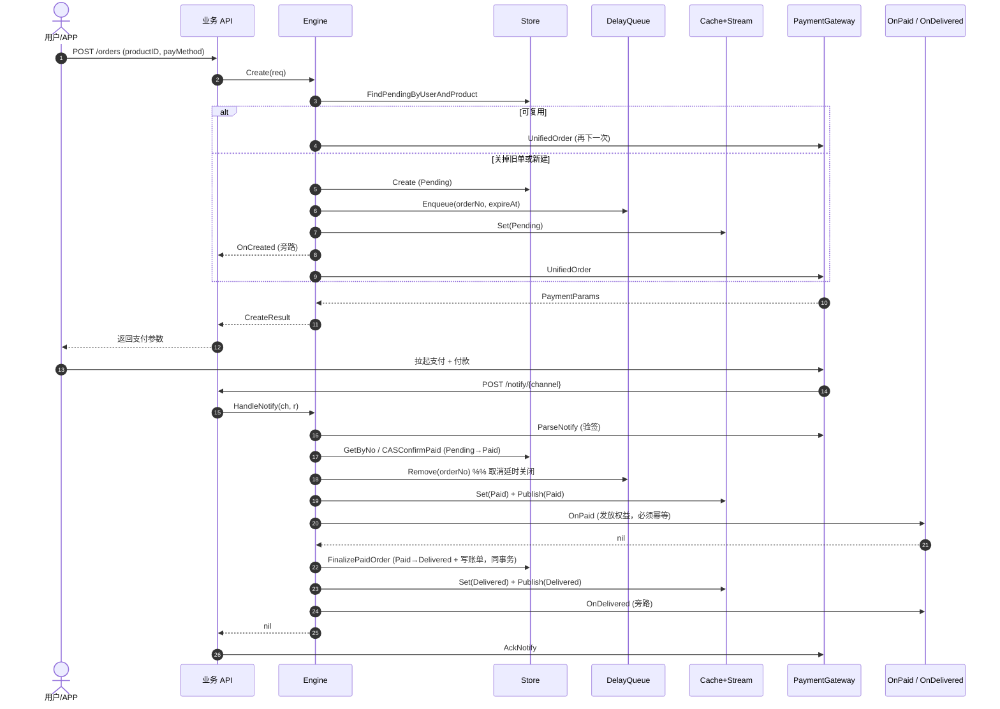
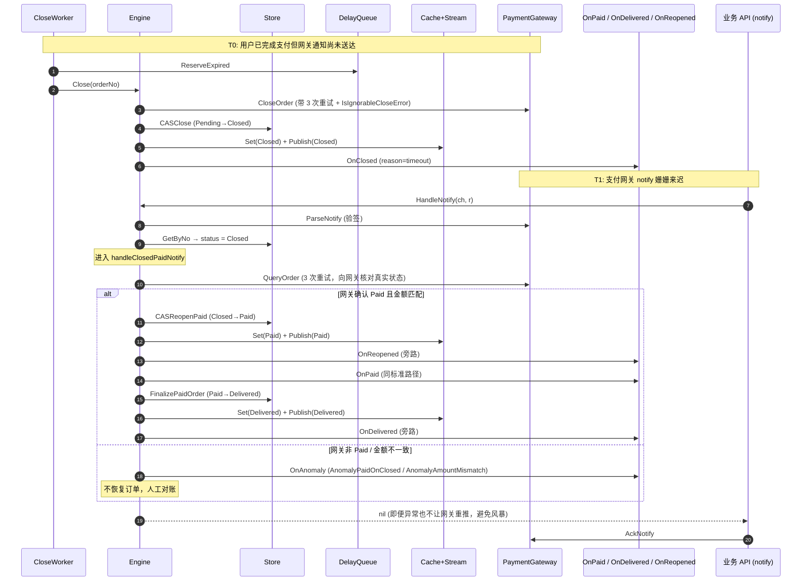

# orderflow

`github.com/gtkit/orderflow` 是一个**可复用的订单流程引擎**，封装了订单创建、支付超时关闭、支付回调处理、履约交付、状态推送和幂等补偿等一整套能力。核心包零第三方依赖，基础设施通过 `drivers/` 子包注入（GORM / Redis / 支付网关均已提供开箱 driver）。

---

## 设计原则

- **核心包零第三方依赖**：只依赖 Go 标准库，gorm / go-redis / go-pay 等封装在 `drivers/` 子包中，各自是独立 Go module，消费者按需引入。
- **泛型订单类型 `O`**：业务方的订单结构体通过实现 `OrderSnapshot` 接口接入，无需改造表结构。
- **能力接口 + 函数钩子的混合风格**：多方法的稳定能力用接口（`Store` / `PaymentGateway` 等），一次性业务决策用函数钩子（`OnPaid` / `OnClosed` 等）。
- **幂等与 CAS 优先**：所有状态跃迁走 CAS，`OnPaid` 钩子必须幂等，失败订单由 fallback worker 兜底补偿。

## 目录结构

```text
orderflow/
├── orderflow.go       Engine[O] + Config[O] + New
├── snapshot.go        OrderSnapshot 接口（业务 Order 必须实现）
├── status.go          OrderStatus + 合法跃迁表
├── spec.go            OrderSpec / ProductInfo / BillSpec
├── store.go           Store[O] 接口 + LogEntry
├── gateway.go         PaymentGateway + Channel + NotifyResult
├── delayqueue.go      DelayQueue 接口
├── cache.go           StatusCache + StatusStream + Subscription
├── locker.go          Locker 接口（可选）
├── hooks.go           业务钩子函数类型
├── events.go          ClosedReason + AnomalyKind 枚举
├── errors.go          sentinel 错误
├── ordernum.go        默认 OrderNo / OrderToken 生成器
├── requests.go        CreateRequest / CreateResult / Timeline
├── engine_lifecycle.go  Create / closeSuperseded / requestPayment
├── engine_notify.go   HandleNotify / handleClosedPaidNotify / finalizeDelivery
├── engine_close.go    Close / CloseByUser / ReconcilePaid
├── engine_query.go    PollStatus / Timeline / ListUserOrders / Subscribe
├── worker/            CloseWorker / CloseFallback / DeliveryFallback + StartAll
└── drivers/
    ├── paymgrgw/      PaymentGateway via github.com/gtkit/go-pay
    ├── gormstore/     Store[O] via GORM（双泛型 Store[O, M]）
    ├── rediscache/    StatusCache + StatusStream + Locker via go-redis
    └── rediszq/       DelayQueue via Redis ZSET 双集合租约
```

---

## 必填依赖一览

接入前先理清楚要实现哪些接口、哪些由 driver 提供、哪些由业务方负责：

| 依赖 | 定义位置 | 接口 / 方法数 | 实现方 | 现成 driver |
|---|---|---|---|---|
| Order 视图 | [`snapshot.go`](./snapshot.go) | `OrderSnapshot`（14 方法，只读） | **业务方必实现** | — |
| 持久化 | [`store.go`](./store.go) | `Store[O]`（14 方法） | driver | [`drivers/gormstore`](./drivers/gormstore) |
| 支付网关 | [`gateway.go`](./gateway.go) | `PaymentGateway`（6 方法） | driver | [`drivers/paymgrgw`](./drivers/paymgrgw) |
| 延时队列 | [`delayqueue.go`](./delayqueue.go) | `DelayQueue`（5 方法） | driver | [`drivers/rediszq`](./drivers/rediszq) |
| 状态缓存 | [`cache.go`](./cache.go) | `StatusCache`（3 方法） | driver | [`drivers/rediscache`](./drivers/rediscache) |
| 状态推送 | [`cache.go`](./cache.go) | `StatusStream`（2 方法） + `Subscription`（2 方法） | driver | [`drivers/rediscache`](./drivers/rediscache) |
| 分布式锁 | [`locker.go`](./locker.go) | `Locker`（1 方法） | driver（**可选**） | [`drivers/rediscache`](./drivers/rediscache) |

业务钩子（全部可选，按需注入）：

| 钩子 | 文件 | 失败策略 |
|---|---|---|
| `OnCreated` | [`hooks.go`](./hooks.go) | WARN 日志，不阻断 |
| `OnPaid` | [`hooks.go`](./hooks.go) | **阻断 finalize**，订单停在 Paid，fallback worker 重试 |
| `OnDelivered` | [`hooks.go`](./hooks.go) | WARN 日志，不阻断 |
| `OnClosed` | [`hooks.go`](./hooks.go) | 旁路观察，无返回值 |
| `OnReopened` | [`hooks.go`](./hooks.go) | 旁路观察，仅在"关闭后又支付成功"路径触发 |
| `OnSuperseded` | [`hooks.go`](./hooks.go) | 旁路观察 |
| `OnAnomaly` | [`hooks.go`](./hooks.go) | 旁路观察，典型对接告警 |

---

## 接入指南（逐步骤）

### Step 1 — 让业务订单实现 `OrderSnapshot`

`OrderSnapshot` 在 [`snapshot.go`](./snapshot.go) 定义。Engine 只通过它读取订单字段，**不直接访问业务结构体**，因此你的 Order 可以完全按照自己的表结构定义字段。

需要实现的 14 个方法：

```go
type OrderSnapshot interface {
    OrderNo() string            // 订单号（对外可见）
    OrderToken() string         // 不可预测 token，客户端轮询 / 订阅 key
    UserID() int64              // 订单归属用户
    Status() OrderStatus        // 当前状态枚举（0/10/20/30/40/50）
    ProductID() uint64
    ProductType() ProductType   // typed enum：1=文本 / 2=视频 / 3=音频 / 99=会员
    ProductTitle() string
    PayMethod() PayMethod       // typed enum：1=微信 / 2=支付宝 / 3=银联
    PayAmount() int64           // 实付金额（分）
    OriginalPrice() int64       // 原价（分）
    TradeNo() string            // 支付网关流水号，空串表示未支付
    ExpireAt() time.Time        // 支付截止时间
    PaidAt() (time.Time, bool)  // 二值形式区分"未支付"与"已支付但零时间戳"
    Extra() map[string]any      // 业务私有数据（如权益快照），Engine 透传不解读
}
```

示例：

```go
package myorder

import (
    "time"

    "github.com/gtkit/orderflow"
)

// Order 是业务方的订单模型（也是 GORM 模型）。
// 核心包不关心字段名、表结构，只通过方法集读取状态。
type Order struct {
    ID            uint64    `gorm:"primaryKey"`
    OrderNoCol    string    `gorm:"column:order_no;type:varchar(64);uniqueIndex"`
    OrderTokenCol string    `gorm:"column:order_token;type:varchar(64);uniqueIndex"`
    UserIDCol     int64     `gorm:"column:user_id;index"`
    StatusCol     int8      `gorm:"column:status;index"`
    ProductIDCol  uint64    `gorm:"column:product_id"`
    // ... 其它业务字段
    ExtraJSON     string    `gorm:"column:extra;type:json"`
}

func (o *Order) OrderNo() string      { return o.OrderNoCol }
func (o *Order) OrderToken() string   { return o.OrderTokenCol }
func (o *Order) UserID() int64        { return o.UserIDCol }
func (o *Order) Status() orderflow.OrderStatus { return orderflow.OrderStatus(o.StatusCol) }
// ... 其它方法
func (o *Order) Extra() map[string]any {
    // 如果用 JSON 列：反序列化 ExtraJSON；也可以返回 nil
    return decodeExtra(o.ExtraJSON)
}
```

### Step 2 — 接入 `Store`（持久化）

`Store[O]` 在 [`store.go`](./store.go) 定义，包含 14 个方法（读 6、写 2、CAS 3、履约 1、日志 2）。推荐直接用 `drivers/gormstore`。

```go
import (
    "github.com/gtkit/orderflow/drivers/gormstore"
    "gorm.io/gorm"
)

store, err := gormstore.New[*myorder.Order, myorder.Order](gormstore.Config[*myorder.Order, myorder.Order]{
    DB:         db,                  // *gorm.DB
    OrderTable: "orders",            // 业务订单表
    BillTable:  "order_bills",       // 账单表（使用 gormstore 内置的 OrderBill 模型）
    LogTable:   "order_logs",        // 状态流水表（使用 gormstore 内置的 OrderLog 模型）

    // 把 *M（GORM 模型指针）包装成 OrderSnapshot 实现。
    // 这里 M = myorder.Order，实现方法集挂在 *Order 上，所以 O = *myorder.Order。
    Wrap: func(m *myorder.Order) *myorder.Order { return m },

    // 把 orderflow.OrderSpec 映射成业务 Order。Engine.Create 内部调用。
    BuildModel: func(spec orderflow.OrderSpec) *myorder.Order {
        return &myorder.Order{
            OrderNoCol:    spec.OrderNo,
            OrderTokenCol: spec.OrderToken,
            UserIDCol:     spec.UserID,
            StatusCol:     int8(spec.Status),
            ProductIDCol:  spec.ProductID,
            ExpireAtCol:   spec.ExpireAt,
            ExtraJSON:     encodeExtra(spec.Extra),
        }
    },

    // 可选：覆盖订单表列名（默认走 order_no / order_token / user_id ... 约定）。
    ColumnMap: gormstore.ColumnMap{
        OrderNo:    "order_no",
        OrderToken: "order_token",
        UserID:     "user_id",
        Status:     "status",
        // ChannelID 是 opt-in 的：显式填写后 FinalizePaidOrder 会自动回查
        // 该列补到 bill.channel_id，让"按渠道对账"开箱可用。
        // 业务订单表无此列时**必须留空**——空字符串语义为"未配置"，跳过回查。
        // ChannelID: "channel_id",
    },

    // 可选：FinalizeExtra 让你在 FinalizePaidOrder 的事务内插入业务扩展写入
    // （如激活 VIP、写积分流水）。失败会回滚整个履约事务——只放"必须和账单原子"的写入。
    FinalizeExtra: func(tx *gorm.DB, order *myorder.Order, bill *gormstore.OrderBill) error {
        return tx.Exec("UPDATE users SET vip_expire_at = ? WHERE id = ?",
            computeVipExpireAt(order), order.UserID()).Error
    },
})
if err != nil {
    return err
}
```

**不用 GORM？** 实现 `Store[O]` 的 14 个方法即可。重点注意：
- 三个 CAS 方法返回 `(int64, error)`——`int64` 是 affected 行数，0 表示并发抢先推进了状态；
- `FinalizePaidOrder` 必须在**同一个事务**里把订单置为 Delivered + 写账单（+ 业务扩展），防止"订单已履约但账单缺失"。

**首次接入快捷迁移**：`gormstore` 提供 `AutoMigrate` 帮你建内置 bill / log 表（业务订单表仍由你自管）：

```go
if err := gormstore.AutoMigrate(db, "order_bills", "order_logs"); err != nil {
    log.Fatal(err)
}
```

业务订单表的必备索引清单见 [`drivers/gormstore/doc.go`](./drivers/gormstore/doc.go) 包注释——`(status, expire_at)`、`(status, paid_at)`、`(user_id, product_id, status)` 等不可省略，否则 fallback worker 会全表扫描。

### Step 3 — 接入 `PaymentGateway`（支付网关）

`PaymentGateway` 在 [`gateway.go`](./gateway.go) 定义，6 个方法屏蔽微信 / 支付宝 / Stripe 等渠道差异。`drivers/paymgrgw` 基于 `github.com/gtkit/go-pay` 提供现成实现：

```go
import (
    "github.com/gtkit/go-pay/paymgr"
    "github.com/gtkit/orderflow/drivers/paymgrgw"
)

mgr, _ := paymgr.NewManager(/* 微信 / 支付宝凭证配置 */)
gateway := paymgrgw.New(mgr, paymgrgw.WithTradeType(paymgr.TradeTypeApp))
```

**安全契约**：`ParseNotify` **必须**完成签名验证后才返回成功，Engine 信任其输出不做二次验签。如果自实现 driver，验签失败必须返回 error，不能返回 `TradeStatusUnpaid` 的 `NotifyResult`——否则攻击者可伪造 POST 触发 `OnPaid` 白发权益。

### Step 4 — 接入 `DelayQueue`（延时队列）

用于订单超时自动关闭。`drivers/rediszq` 基于 Redis ZSET 双集合租约：

```go
import "github.com/gtkit/orderflow/drivers/rediszq"

dq := rediszq.MustNew(rdb, "orderflow:delay:close",
    rediszq.WithMaxBatch(500),
    rediszq.WithDefaultTimeout(3 * time.Second),
)
```

> Redis 集群部署时，`key` 必须用 hash tag（如 `"{orderflow}:delay:close"`）保证同 slot，否则双集合租约脚本会报 CROSSSLOT。详见 [`drivers/rediszq/doc.go`](./drivers/rediszq/doc.go)。

### Step 5 — 接入 `StatusCache` + `StatusStream`

`drivers/rediscache` 一包两用：

```go
import "github.com/gtkit/orderflow/drivers/rediscache"

cache := rediscache.NewStatusCache(rdb,
    rediscache.WithCacheKeyPrefix("orderflow:status"),
    rediscache.WithPendingGrace(30 * time.Second),         // Pending TTL 比 ExpireAt 再宽限一点
    rediscache.WithFallbackTTL(24 * time.Hour),            // 未配置 TTL 的状态走兜底
    rediscache.WithTTL(orderflow.StatusDelivered, 7*24*time.Hour),
)

stream := rediscache.NewStatusStream(rdb,
    rediscache.WithStreamKeyPrefix("orderflow:stream"),
)
```

### Step 6 — 可选：接入 `Locker`

在 `Create` 流程中对 `(user_id, product_id)` 加分布式锁，阻断并发下单产生多个 Pending。不配置时 Engine 不加锁。

```go
locker := rediscache.NewLocker(rdb, rediscache.WithLockerKeyPrefix("orderflow:lock"))
```

推荐配合 DB 部分唯一索引（`UNIQUE (user_id, product_id) WHERE status = 'pending'`）做"前端 debounce + 应用层锁 + DB 兜底"三层防御。

### Step 7 — 配置业务钩子

```go
onPaid := func(ctx context.Context, o *myorder.Order, n orderflow.NotifyResult) error {
    // 【幂等强约束】此钩子可能被多次调用（重复回调 / fallback 重试 / CASReopenPaid 恢复）
    // 以 orderNo 为幂等键，副作用写入同一份数据源 + 唯一约束。
    return vipSvc.Activate(ctx, vipsvc.ActivateReq{
        OrderNo:  o.OrderNo(),        // 幂等键
        UserID:   o.UserID(),
        Duration: decodeDuration(o.Extra()["duration"]),
    })
}

onAnomaly := func(ctx context.Context, o *myorder.Order, kind orderflow.AnomalyKind, detail string) {
    alerting.Send(kind, o.OrderNo(), detail) // 接告警，人工介入
}
```

### Step 8 — 构造 `Engine`

```go
import (
    "context"
    "time"

    "github.com/gtkit/logger"
    "github.com/gtkit/orderflow"
    "go.uber.org/zap"
)

// 业务方在 main() 里初始化 gtkit/logger（日志路径、文件分割、等级等参数按业务调）
_ = logger.New(logger.WithConsole(true))

// 把 gtkit/logger 包装成 orderflow.Logger 接口（4 方法 + ctx + Field 列表）
type gtkitLogger struct{}

func (gtkitLogger) Debug(ctx context.Context, msg string, fs ...orderflow.Field) {
    logger.DebugCtx(ctx, msg, toZapFields(fs)...)
}
func (gtkitLogger) Info(ctx context.Context, msg string, fs ...orderflow.Field) {
    logger.InfoCtx(ctx, msg, toZapFields(fs)...)
}
func (gtkitLogger) Warn(ctx context.Context, msg string, fs ...orderflow.Field) {
    logger.WarnCtx(ctx, msg, toZapFields(fs)...)
}
func (gtkitLogger) Error(ctx context.Context, msg string, fs ...orderflow.Field) {
    logger.ErrorCtx(ctx, msg, toZapFields(fs)...)
}

func toZapFields(fs []orderflow.Field) []zap.Field {
    out := make([]zap.Field, len(fs))
    for i, f := range fs {
        out[i] = zap.Any(f.Key, f.Value)
    }
    return out
}

engine, err := orderflow.New[*myorder.Order](orderflow.Config[*myorder.Order]{
    // ----- 能力接口（必填） -----
    Store:      store,
    Gateway:    gateway,
    DelayQueue: dq,
    Cache:      cache,
    Stream:     stream,

    // ----- 业务钩子（可选） -----
    OnPaid:       onPaid,
    OnAnomaly:    onAnomaly,
    OnClosed:     func(ctx context.Context, o *myorder.Order, reason orderflow.ClosedReason) { /* ... */ },
    OnReopened:   func(ctx context.Context, o *myorder.Order, n orderflow.NotifyResult) { /* ... */ },
    OnSuperseded: func(ctx context.Context, old *myorder.Order, newProductID uint64) { /* ... */ },

    ResolveChannel: func(payMethod orderflow.PayMethod) orderflow.Channel {
        switch payMethod {
        case orderflow.PayMethodWechat:
            return "wechat"
        case orderflow.PayMethodAlipay:
            return "alipay"
        case orderflow.PayMethodUnion:
            return "unionpay"
        }
        return ""
    },
    BuildNotifyURL: func(ch orderflow.Channel) string {
        return cfg.BaseURL + "/api/v1/orders/notify/" + string(ch)
    },

    // ----- 参数（全部可选，有合理默认） -----
    OrderExpire:           30 * time.Minute,         // Pending 订单有效期
    CreateLockTTL:         10 * time.Second,
    Timezone:              "Asia/Shanghai",
    Logger:                gtkitLogger{},             // 上面包装的 orderflow.Logger 实现；不传则使用内置 nopLogger（丢弃所有日志）
    Locker:                locker,                    // 不传则不加锁
    CloseSupersededPolicy: orderflow.SupersededDegraded, // 推荐：网关 CloseOrder 失败时不阻塞用户下新单（默认 Strict 保持 v1.0.0 行为）
    // Observer: otelObserver,                // Prometheus / OTEL 适配器
})
if err != nil {
    return err
}
```

### Step 9 — 启动 worker

```go
import "github.com/gtkit/orderflow/worker"

// 默认节奏（PollInterval=1s / BatchSize=50 / MaxWorkers=15 ...）
go worker.StartAll(ctx, engine)

// 自定义节奏
opts := worker.Options{
    Close:            worker.CloseOptions{PollInterval: 2 * time.Second, MaxWorkers: 32},
    CloseFallback:    worker.CloseFallbackOptions{Interval: 10 * time.Minute},
    DeliveryFallback: worker.DeliveryFallbackOptions{Interval: 30 * time.Second},
}
// 可选：发布前预检 CloseOptions 字段间合理性（PollLease >= 2*CloseTimeout 等）。
// NewCloseWorker 内部也会自动检查并输出 WARN 日志，但不阻断启动。
if err := opts.Close.Validate(); err != nil {
    log.Fatalf("invalid worker options: %v", err)
}
go worker.StartAllWithOptions(ctx, engine, opts)
```

三个 worker 的职责：

| Worker | 职责 | 消费源 |
|---|---|---|
| `CloseWorker` | 取延时队列到期任务 → `Engine.Close` | `DelayQueue.ReserveExpired` |
| `CloseFallback` | 扫 DB 中"已过期但未 Closed" Pending 单 → `Engine.Close` | `Store.FindExpiredPending` |
| `DeliveryFallback` | 扫 DB 中"Paid 但未 Delivered" → `Engine.ReconcilePaid` | `Store.FindPaidUndelivered` |

### Step 10 — 接 HTTP 路由

**下单**：

```go
func createOrderHandler(engine *orderflow.Engine[*myorder.Order]) http.HandlerFunc {
    return func(w http.ResponseWriter, r *http.Request) {
        userID := authFromCtx(r.Context())       // 鉴权后 userID，禁止读 body/query
        var req CreateOrderBody
        _ = json.NewDecoder(r.Body).Decode(&req)

        product, err := productSvc.GetByID(r.Context(), req.ProductID)
        if err != nil { /* 404 */ return }

        result, err := engine.Create(r.Context(), orderflow.CreateRequest{
            UserID:    userID,
            PayMethod: req.PayMethod,
            ChannelID: req.ChannelID,
            ClientIP:  clientIP(r),
            Product: orderflow.ProductInfo{
                ID: product.ID, Type: product.Type, Title: product.Title,
                Price: product.Price,
                Extra: map[string]any{"duration": product.Duration},
            },
        })
        switch {
        case errors.Is(err, orderflow.ErrConcurrentCreate):
            http.Error(w, "操作太频繁，请稍后重试", http.StatusTooManyRequests)
            return
        case err != nil:
            http.Error(w, "internal", http.StatusInternalServerError)
            return
        }

        _ = json.NewEncoder(w).Encode(map[string]any{
            "order_no":       result.Order.OrderNo(),
            "order_token":    result.Order.OrderToken(),
            "payment_params": result.PaymentParams,
            "reused":         result.Reused,
        })
    }
}
```

**支付回调**：

```go
// 路由：POST /api/v1/orders/notify/{channel}
func notifyHandler(engine *orderflow.Engine[*myorder.Order], gateway orderflow.PaymentGateway) http.HandlerFunc {
    return func(w http.ResponseWriter, r *http.Request) {
        ch := orderflow.Channel(r.PathValue("channel"))
        if err := engine.HandleNotify(r.Context(), ch, r); err != nil {
            // HandleNotify 只在"解析 / CAS 系统错误"时返回 err
            // 业务异常（金额不一致、状态机例外）已走 OnAnomaly，这里 err == nil
            engine.Logger().Error(r.Context(), "handle notify fatal",
                orderflow.Err(err))
            http.Error(w, "internal", http.StatusInternalServerError)
            return
        }
        if err := gateway.AckNotify(ch, w); err != nil {
            engine.Logger().Error(r.Context(), "ack notify failed",
                orderflow.Err(err))
        }
    }
}
```

**查询 + 订阅**：见下方 [查询与订阅：轮询 + SSE](#查询与订阅轮询--sse) 章节。

---

## 订单生命周期与状态流转

### 状态机

```text
              Create                  CASConfirmPaid
    ┌───────────────────────┐   ┌───────────────────────┐
    │                       ▼   │                       ▼
  start ──►  Pending ─────► Paid ─────► Delivered ─────► Completed
                │  ▲         │          (FinalizePaid)
                │  │         │
                │  │ CASReopenPaid（特殊路径：关闭后网关确认已付）
                │  │
                ▼  │
              Closed / Cancelled
                 (终态，除非 CASReopenPaid 恢复)
```

合法跃迁表（[`status.go`](./status.go) `CanTransitionTo`）：

| 从 | 可到达 |
|---|---|
| `Pending`（0） | `Paid` / `Closed` / `Cancelled` |
| `Paid`（10） | `Delivered` / `Closed`（异常，`CASReopenPaid` 反向恢复） |
| `Delivered`（20） | `Completed` |
| `Completed`（30）/ `Closed`（40）/ `Cancelled`（50） | 终态，不再跃迁 |

`OrderStatus.IsTerminal()` 对 `Completed` / `Closed` / `Cancelled` 三个状态返回 `true`。

支付超时仍然走 `Pending -> Closed (reason=timeout)`，不区分独立的 Expired 状态。关闭原因通过 `ClosedReason` 枚举区分（`timeout` / `superseded` / `manual` / `enqueue_fail`）。

### 正常支付流程（时序图）



### 特殊路径：订单已关闭，之后收到支付成功回调

这是实际生产中最容易踩坑的竞态，由 [`engine_notify.go:188 handleClosedPaidNotify`](./engine_notify.go) 处理。

**场景触发**：
- 用户在超时临界点支付成功，网关已扣款但通知延迟；
- `CloseWorker` 抢先将本地订单标为 `Closed`；
- 网关回调送达时订单状态已是 `Closed`，普通跃迁表禁止 `Closed → Paid`。

**处理策略**：不信任单一数据源，**向网关主动查询**确认真实状态，再走专用 CAS 路径 `CASReopenPaid` 逆向恢复：



**关键防线**：
- **仅网关 QueryOrder 为准**：即便 notify 里写着 paid，也必须向网关回拨查询确认。对抗伪造 notify + 网关自家 bug 造成的状态污染。
- **金额二次校验**：`query.TotalAmount` 与订单 `PayAmount` 不一致直接走 `OnAnomaly`，拒绝恢复。
- **`CASReopenPaid` 独立 CAS 方法**：和 `CASConfirmPaid` 语义分离，driver 可以单独做审计日志/报警；affected=0 表示并发已处理完，当次 skip。
- **OnReopened 先触发、OnPaid 后触发**：给业务一个"知道这是异常恢复单"的专用钩子；`OnPaid` 幂等约束保证即便此路径重入也不重复发放权益。

### 其它异常路径（会触发 `OnAnomaly`）

| `AnomalyKind` | 触发场景 | Engine 动作 |
|---|---|---|
| `AmountMismatch` | notify 金额 ≠ 订单金额 | 不推进状态，等人工介入 |
| `TradeNoMismatch` | 同一订单不同 notify 出现不同 tradeNo | 不推进状态 |
| `PaidOnClosed` | Closed 订单收到 notify，但网关查询非 Paid | 不 reopen，仅告警 |
| `OrderDisappeared` | CAS 失败后 recheck 发现订单消失 | ALERT 日志 + 告警 |
| `UnexpectedStatus` | 进入状态机未覆盖的分支 | 告警 |
| `DeliveryFailed` | `OnPaid` 或 `FinalizePaidOrder` 失败 | 订单停在 Paid，`DeliveryFallback` 补偿 |
| `GatewayQueryFailed` | 查询网关 3 次重试全失败 | 不尝试恢复，人工对账 |

### 履约失败的兜底路径

```text
HandleNotify → CASConfirmPaid OK
             → OnPaid FAIL (DB 抖动 / 外部 API 超时)
             → OnAnomaly(DeliveryFailed)
             → 订单状态停留在 Paid
             │
             ▼
DeliveryFallback worker 周期扫描
             → Store.FindPaidUndelivered
             → Engine.ReconcilePaid
             → 重走 OnPaid + FinalizePaidOrder（幂等）
```

因此 `OnPaid` 必须幂等——相同 orderNo 的重入不能产生重复副作用（以 orderNo 为幂等键、副作用带唯一约束、外部 API 调用前先查本地完成标记）。

---

## 查询与订阅：轮询 + SSE

订单状态读路径有两条，**面向不同客户端场景，实践上通常同时使用**：

| 能力 | API | 底层接口 | 适用 |
|---|---|---|---|
| 轮询 | `Engine.PollStatus` | `StatusCache` | APP 定时拉，网络差、兼容性最好 |
| 推送 | `Engine.Subscribe` | `StatusStream` | SSE / WebSocket 实时通知 |
| 流水 | `Engine.Timeline` | `Store.ListLogsByOrderNo` | 订单详情页展示变更历史 |

**重要约束**：

- `Engine.Subscribe` 不做 `userID` 归属校验（直接透传到 driver），**业务侧 handler 必须自己鉴权**；`PollStatus` / `Timeline` 会做（传错 userID 返回 `ErrOrderForbidden`）。
- Redis Pub/Sub **不保留历史**——Subscribe 只能收到订阅建立之后的事件。所以 SSE handler 必须"先 Poll 拿当前状态作首帧，再挂 Subscribe 接后续变更"，否则会丢失订阅建立瞬间的跃迁。
- `Subscription.Close` 幂等，`defer sub.Close()` 无副作用。
- 进入终态（`OrderStatus.IsTerminal` 为 true）后不会再有事件，handler 可直接结束连接。

### 轮询 handler

```go
func pollHandler(w http.ResponseWriter, r *http.Request) {
    userID := authFromCtx(r.Context())  // 从鉴权上下文取，禁止读 query/body
    orderToken := r.PathValue("token")

    res, err := engine.PollStatus(r.Context(), orderToken, userID)
    switch {
    case errors.Is(err, orderflow.ErrOrderNotFound):
        http.Error(w, "not found", http.StatusNotFound)
        return
    case errors.Is(err, orderflow.ErrOrderForbidden):
        http.Error(w, "forbidden", http.StatusForbidden)
        return
    case err != nil:
        http.Error(w, "internal", http.StatusInternalServerError)
        return
    }

    _ = json.NewEncoder(w).Encode(res)  // {"Status":2,"StatusText":"paid"}
}
```

### SSE handler（Poll 首帧 + Subscribe 后续）

```go
func sseHandler(w http.ResponseWriter, r *http.Request) {
    userID := authFromCtx(r.Context())
    orderToken := r.PathValue("token")

    // 1. 先用 PollStatus 做归属校验 + 拿当前状态作首帧。
    //    Subscribe 建立前的跃迁只能从这里拿到，漏掉就追不回来了。
    cur, err := engine.PollStatus(r.Context(), orderToken, userID)
    switch {
    case errors.Is(err, orderflow.ErrOrderNotFound):
        http.Error(w, "not found", http.StatusNotFound)
        return
    case errors.Is(err, orderflow.ErrOrderForbidden):
        http.Error(w, "forbidden", http.StatusForbidden)
        return
    case err != nil:
        http.Error(w, "internal", http.StatusInternalServerError)
        return
    }

    w.Header().Set("Content-Type", "text/event-stream")
    w.Header().Set("Cache-Control", "no-cache")
    w.Header().Set("Connection", "keep-alive")
    flusher, ok := w.(http.Flusher)
    if !ok {
        http.Error(w, "streaming unsupported", http.StatusInternalServerError)
        return
    }

    writeEvent := func(s orderflow.OrderStatus) {
        fmt.Fprintf(w, "event: status\ndata: {\"status\":%d,\"text\":%q}\n\n", s, s.String())
        flusher.Flush()
    }

    // 2. 首帧 —— 当前状态。终态直接结束，无需订阅。
    writeEvent(cur.Status)
    if cur.Status.IsTerminal() {
        return
    }

    // 3. 挂订阅接后续变更。
    sub, err := engine.Subscribe(r.Context(), orderToken)
    if err != nil {
        return  // 首帧已发，客户端据此兜底轮询即可
    }
    defer sub.Close()

    // 4. 事件循环：客户端断开 / driver 关闭 channel / 进入终态都会退出。
    keepalive := time.NewTicker(15 * time.Second)
    defer keepalive.Stop()

    for {
        select {
        case <-r.Context().Done():
            return
        case status, ok := <-sub.Events():
            if !ok {
                return  // driver 主动关闭
            }
            writeEvent(status)
            if status.IsTerminal() {
                return
            }
        case <-keepalive.C:
            fmt.Fprint(w, ": ping\n\n")  // 注释行，防止中间代理切连接
            flusher.Flush()
        }
    }
}
```

**客户端侧建议**：SSE 断线后降级为 `PollStatus` 轮询到终态，不要无限重连 SSE——既省连接数，又能避开代理/网关 30s 空闲超时造成的断流。

---

## 钩子执行时序（重要）

`OnPaid` 是"支付确认后、订单写 Delivered 前"被调用的业务钩子。Engine 的履约流程（`finalizeDelivery`）为：

```text
CAS Pending -> Paid   (Store.CASConfirmPaid)
       │
       ├── OnPaid(ctx, order, notify)        业务侧权益发放（VIP / 发货 / 积分）
       │                                     必须幂等 —— fallback scanner 会重试
       │
       ├── Store.FinalizePaidOrder(order, bill)   订单 -> Delivered，写账单
       │                                     （可带 FinalizeExtra 在同事务激活业务扩展）
       │
       ├── StatusCache.Set(Delivered) + StatusStream.Publish(Delivered)
       │
       └── OnDelivered(ctx, order)           旁路观察（失败仅告警，不影响主流程）
```

**关键不变量**：
- 任何一步失败，Engine 都不会对支付网关返回错误（避免重试风暴）；
- 失败订单会停留在 `Paid` 状态，由 `ReconcilePaid` 供 fallback worker 后续补偿；
- 因此 `OnPaid` **必须幂等**：重复调用不产生副作用（以 orderNo 为幂等键 + 副作用唯一约束）。

---

## 调用方鉴权责任（必读）

Engine **不做用户身份鉴权**，假设所有传入的 `userID` 已经来自业务侧的鉴权上下文。

- **`CreateRequest.UserID`** 必须从 JWT / Session 解出，不得从 HTTP body / query / header 直接透传。否则攻击者可传他人 UserID，通过 `FindPendingByUserAndProduct` 找到受害者订单并 `closeSuperseded` 关闭（DoS）。
- **`PollStatus` / `Timeline` / `CloseByUser` 的 `userID`** 同样必须来自鉴权上下文。Engine 内部基于此做归属校验（`ErrOrderForbidden`）；HTTP query 直接透传等于校验形同虚设。
- **`ListUserOrders` 不做二次校验**，直接透传给 Store。调用方必须保证 `userID` 来自鉴权上下文。
- **`Close(orderNo)`** 不做 UserID 校验，仅供后台 / worker 使用。开放给用户"主动取消"应用 `CloseByUser`；后台 / 风控强制关单使用 `CloseByAdmin`。
- **`HandleNotify`** 不依赖用户身份，但要求 `PaymentGateway.ParseNotify` 完成验签。

### Token 撤销 / 风控止血

`OrderToken` 默认与订单生命周期等长，没有内置失效机制——这是为了让用户离线后仍能查订单。当业务方检测到 token 异常访问（IP 漂移、客服工单、风控告警）时，可以**主动撤销**：

```go
// 1. 立即让缓存查询失效
_ = cache.Delete(ctx, orderToken)

// 2. 业务侧维护一张 revoked tokens 黑名单（推荐做成一张 DB 表 + Redis 缓存）
//    在自己实现的 Store.GetByToken 内首查黑名单，命中则返回 ErrOrderForbidden
```

orderflow 库本身**不内置黑名单**——保持中立，把策略交给业务侧。如果只用第 1 步（不做黑名单），下一次 PollStatus 回源 DB 后会重新填充缓存——撤销只是临时止血。彻底撤销需要持久化标记。

---

## 运维 / 后台 API

### `Engine.Healthy(ctx)` —— K8s readiness probe / 启动自检

聚合探测 Store / Cache / Stream / DelayQueue / Locker 五个依赖，任一失败即返回非 nil error（带依赖名前缀）。依赖能力可选实现 `orderflow.Healther` 接口（含 `Ping(ctx) error`）即可被探测，未实现的跳过。

```go
http.HandleFunc("/healthz", func(w http.ResponseWriter, r *http.Request) {
    ctx, cancel := context.WithTimeout(r.Context(), 2*time.Second)
    defer cancel()
    if err := engine.Healthy(ctx); err != nil {
        http.Error(w, err.Error(), http.StatusServiceUnavailable)
        return
    }
    w.WriteHeader(http.StatusOK)
})
```

`Gateway` 默认不探测——网关健康语义多变（白名单 IP、签名密钥），由业务侧在网关 driver 内自行实现。

### `Engine.CloseByAdmin(ctx, orderNo, reason)` —— 强制关单

适用于风控规则触发、客服工单处理、后台运营强关。**绕过 ExpireAt 守卫**——未到期的 Pending 订单也能直接关闭。

⚠ **调用方鉴权强约束**：API 名字里的 "Admin" 仅表示"绕过过期校验 + 流水标记 admin actor"，**Engine 不做身份校验**。调用方必须自己完成 RBAC 判断，并把此接口**仅绑定到运维内网 / 鉴权 middleware 之后的路径**——直接暴露给对外路由（如 `POST /api/orders/{no}/close-by-admin`）等于让普通用户也能强制关单。

保留的库内安全约束：
- 仅 Pending 订单可被关闭（Paid/Delivered 状态调用直接 skip，避免误关已支付订单）；
- 网关 `CloseOrder` 仍然被调用 + 重试；
- 状态推送、流水、`OnClosed` 钩子全部触发，actor 标记为 `admin`，reason 写入流水 remark。

```go
// 风控规则命中
if err := engine.CloseByAdmin(ctx, orderNo, "fraud:rule-42"); err != nil {
    return err
}

// 客服工单
_ = engine.CloseByAdmin(ctx, orderNo, fmt.Sprintf("ticket:%d", ticketID))
```

`reason` 留空也合法——但建议传业务定义的"规则 ID / 工单号"以便事后审计。

---

## 上线前清单（必读必做）

库代码本身已具备生产可用性，但以下 10 项是**业务方部署前必须完成**的工作——不做会让"看起来正常运行"的系统在真实流量下暴露漏洞或性能问题。建议作为 release 前的 checklist 逐条核对。

### 1. 建 DB 索引

按 [`drivers/gormstore/doc.go`](./drivers/gormstore/doc.go) 包注释的"必备索引清单"建索引：`(status, expire_at)`、`(status, paid_at)`、`(user_id, product_id, status)` 等不可省略，否则 fallback worker 与查询路径会全表扫描。

### 2. 建议加部分唯一索引（"一用户一商品一 Pending"DB 兜底）

```sql
-- PostgreSQL
CREATE UNIQUE INDEX uk_user_product_pending ON orders (user_id, product_id) WHERE status = 0;
-- MySQL: 用生成列 + 普通唯一索引模拟
```

这是"前端 debounce + 应用层 Locker + DB 兜底"三层防御里的最后一道，确保任何代码 bug 都不能让同用户同商品出现两个 Pending。

### 3. API 网关层做 per-IP / per-user 速率限制

`PollStatus` / `Subscribe` 没有内置限流——这是 API 网关 / 反代（Nginx `limit_conn` / `limit_req`、Cloudflare、Envoy）的标准能力。配置后即可挡住单用户大量长连接耗尽 Redis 连接池的风险。

### 4. 业务方实现的 `OnPaid` 钩子必须幂等

支付回调可能重复推送、`DeliveryFallback` 会扫到 `OnPaid` 失败的订单重试——同一订单的 `OnPaid` 多次调用必须产生相同副作用。强烈推荐用 [`drivers/rediscache.IdempotentOnPaidViaRedis`](./drivers/rediscache/locker.go) 包装：

```go
cfg.OnPaid = rediscache.IdempotentOnPaidViaRedis(myOnPaid, rdb, "orderflow:onpaid:", 24*time.Hour)
```

### 5. 注入 `Config.ResolveChannel` + `Config.BuildNotifyURL`

默认实现按 typed enum 内置映射 `Wechat -> "wechat"` / `Alipay -> "alipay"` / `Union -> "unionpay"`，未识别值返回空。生产环境如需自定义网关命名（如带 `_app` / `_h5` 后缀分流），应注入定制实现：

```go
cfg.ResolveChannel = func(pm orderflow.PayMethod) orderflow.Channel {
    switch pm {
    case orderflow.PayMethodWechat: return "wechat_app"
    case orderflow.PayMethodAlipay: return "alipay_app"
    case orderflow.PayMethodUnion:  return "unionpay"
    default:
        // 业务侧应在 Engine.Create 之前拒绝未知支付方式
        return ""
    }
}
cfg.BuildNotifyURL = func(ch orderflow.Channel) string {
    return "https://api.yourdomain.com/payment/notify/" + url.PathEscape(string(ch))
}
```

### 6. `CloseByAdmin` 仅暴露在鉴权 middleware 之后的内网路径

API 名字里的 "Admin" **不代表** Engine 帮你校验身份。直接绑到对外路由 `POST /api/orders/{no}/close-by-admin` 等于让所有用户都能强制关单。**正确做法**：放在仅运维 IP 白名单可达的内网 endpoint，前置 RBAC middleware 校验 `claims.role` 在 `admin / ops / cs` 之内。

### 7. 配 `Config.Locker`

```go
cfg.Locker = rediscache.NewLocker(rdb)
cfg.CreateLockTTL = 10 * time.Second
```

注入后 `Engine.Create` 会按 `(user_id, product_id)` 串行化，避免并发下单产生多个 Pending。配合 #2 的 DB 部分唯一索引兜底。

⚠ **生产 HA 提示**：`drivers/rediscache.Locker` 基于单实例 `SET NX EX`——Redis 主从异步复制下故障切换瞬间可能"双客户端持同一锁"，对一致性敏感的场景应改用 [redsync](https://github.com/go-redsync/redsync) 跑多实例 Redlock。详见 [`drivers/rediscache/locker.go`](./drivers/rediscache/locker.go) GoDoc。

### 8. 配 `Engine.Healthy` 到 K8s readiness probe

```go
http.HandleFunc("/healthz", func(w http.ResponseWriter, r *http.Request) {
    ctx, cancel := context.WithTimeout(r.Context(), 2*time.Second)
    defer cancel()
    if err := engine.Healthy(ctx); err != nil {
        http.Error(w, err.Error(), http.StatusServiceUnavailable)
        return
    }
    w.WriteHeader(http.StatusOK)
})
```

依赖能力故障时 K8s 自动剔除流量，避免请求落到坏 pod 上失败堆积。

### 9. 接 Observer 到监控

实现 `orderflow.Observer` 把 `Event` / `Duration` 翻译成 Prometheus counter / histogram（或 OpenTelemetry span）。**重点告警** `EventAnomaly` 系列——尤其是：

- `kind=hook_panic`：业务钩子 panic（被 recover 但需修 bug）
- `kind=append_log_failed`：流水写入失败（合规风险）
- `kind=publish_status_cache_inconsistent`：缓存与状态不一致（用户可能轮询到错误状态）
- `kind=poll_cache_get_failed`：缓存抖动（即将打爆 DB）

详见 [`observer.go`](./observer.go) `EventKind` 与 `AnomalyKind` 列表。

### 10. 启动 `worker.StartAll`

```go
go worker.StartAll(ctx, engine)  // 三个 worker 一次起：CloseWorker / CloseFallback / DeliveryFallback
```

三者缺一不可：`CloseWorker` 消费延时队列（主路径）、`CloseFallback` 兜底 Redis 数据丢失、`DeliveryFallback` 兜底 OnPaid 失败。生产部署时建议每个微服务实例都跑——它们靠 `ReserveExpired` 的原子租约协调，不需要 leader election。

---

## 里程碑与版本

本仓当前为 **v1.0.0 稳定版**，遵循 [SemVer 2.0.0](https://semver.org/lang/zh-CN/) 严格模式。

主要里程碑：

- `v0.1.0`：骨架落地，定义全部接口与类型
- `v0.2.0`：`Engine.Create / PollStatus / Timeline / ListUserOrders / Subscribe / HandleNotify / Close / ReconcilePaid` 核心方法
- `v0.3.0`：`worker/` 子包（`CloseWorker` / `CloseFallback` / `DeliveryFallback` + `StartAll`）
- `v0.4.0` ~ `v0.4.3`：4 个 driver 全部落地（`paymgrgw` / `gormstore` / `rediscache` / `rediszq`）
- `v1.0.0`（**当前**）：稳定化，进入 SemVer 严格模式

发版与依赖维护规范见 [`drivers/RELEASING.md`](./drivers/RELEASING.md)。

---

## 相关约束

- **Go 1.26.2+**
- 日志通过 `orderflow.Logger` 接口注入（核心包零外部日志依赖）；推荐包装 `github.com/gtkit/logger`，包装示例见 Step 8 与 [`logger.go`](./logger.go) GoDoc。**禁止**使用 `log/slog`。
- JSON 序列化统一使用 `github.com/gtkit/json`，禁止使用 `encoding/json`。
- Redis 集群：`rediszq` 的 key 必须带 hash tag（如 `"{orderflow}:delay:close"`）。
- 生产告警：日志中 `"orderflow: ALERT ..."` 与 `"orderflow: panic in ... recovered"` 开头的 ERROR 必须配告警。
- drivers 发版前必须通过 `scripts/check-release.sh`，确保无本地 replace 指令残留。
