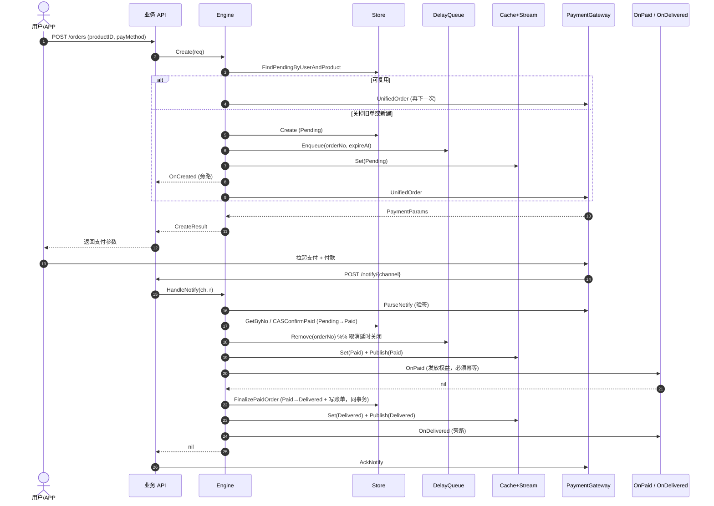
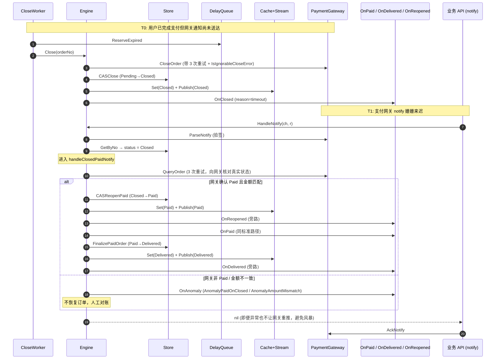
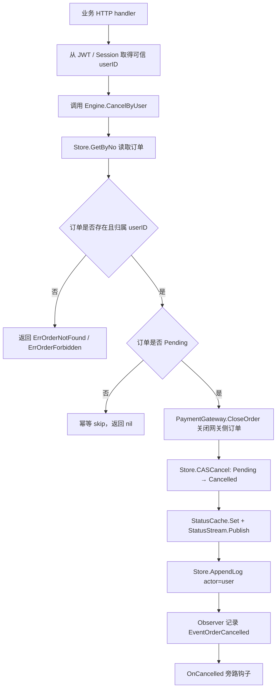

# orderflow

> ⚠️ 本库定位为**特定场景脚手架**，不是通用订单引擎。接入前请先阅读「适用场景」一节。

`github.com/gtkit/orderflow` 是一个面向**单商品虚拟交付订单（数字内容 / 虚拟商品 / 会员权益）**的流程引擎，封装订单创建、支付超时关闭、支付回调处理、履约交付、状态推送和幂等补偿等能力。核心包零第三方依赖，基础设施（数据库 / Redis / 支付网关）通过 `drivers/` 子包注入。

> **生产部署接入方**：请优先阅读 [`PRODUCTION_CHECKLIST.md`](./PRODUCTION_CHECKLIST.md)
> ——首次部署前的硬门禁清单，覆盖安全 / 幂等 / 基础设施 / 配置 / 监控告警 5 大类。
> 漏一项可能导致资损或监控盲区。

---

## 适用场景

本库为**特定形态的订单业务**设计，不追求通用：

### ✅ 适用

- **单商品订单**：一笔订单对应一个商品 / 服务 / 权益
- **虚拟交付**：数字内容（文本 / 视频 / 音频）、虚拟商品、会员权益激活——无物流的交付
- **中国大陆主流三方支付**：微信、支付宝、银联（通过 `paymgrgw` driver）
- **支付回调驱动的状态机**：订单状态严格遵循 `Pending → Paid → Delivered`，支持「已关闭后又支付成功」的恢复路径，并对「已取消后又支付成功」做专用异常处理
- **延时关单 + 幂等履约**：支付超时自动关闭、回调 / 履约钩子幂等重试
- **退款（自行编排）**：v1.7.0+ 提供 `RefundGateway` 协议层抽象（屏蔽微信 / 支付宝退款 SDK 差异），编排由调用方自行实现——审批工作流、金额计算、退款记录持久化、反向核销均由业务方控制

### ❌ 不适用

以下场景请改用其他方案，或基于本库的接口抽象方式自行扩展，**而不是改造核心代码**：

- **多商品订单**：购物车、多 SKU 拆单、混合履约
- **跨境支付**：Stripe / PayPal / 卡组织直连
- **SaaS 订阅 / 周期扣款 / 自动续费**
- **to B 合同流程**：线下打款、对公审批、分期收款、发票流
- **实物订单**：物流、库存、仓配、退换货
- **复杂分账 / 多渠道结算**

如果你的业务字段（如 `PayMethod` / `ProductType`）不在内置枚举范围内，本库当前不提供枚举注册表机制——请自行评估是否值得 fork。

---

## 基础设施契约

本库**不负责创建或管理任何基础设施实例**。`*gorm.DB`、`*redis.Client`、`*paymgr.Manager` 等外部依赖由调用方在应用启动时构造，并通过 driver 工厂函数注入。

| 资源 | 调用方职责 | driver 接收入口 |
|---|---|---|
| `*gorm.DB` | 创建、连接池配置、监控接入、优雅关闭 | `gormstore.Config{ DB: db }` |
| `*redis.Client` | 创建、TLS / 哨兵 / 集群配置、监控、优雅关闭 | `rediscache.NewStatusCache(rdb, ...)` 等 |
| `*paymgr.Manager` | 创建、渠道密钥配置、回调路由 | `paymgrgw.New(mgr, ...)` |

### 为什么这样设计

- **避免连接重复**：你的项目中通常已有 `*gorm.DB` / `*redis.Client` 实例供其他模块共享。本库自建连接会导致连接池翻倍、超时 / 监控配置分裂
- **生命周期清晰**：连接的创建与销毁绑定到应用进程，由 `main` 统一管理，不由业务库托管
- **测试更灵活**：调用方可注入 sqlmock / testcontainers / 自定义 mock，库无需提供「测试模式」开关
- **多版本兼容**：调用方决定 GORM 版本、go-redis 版本（v8 / v9 / 集群 / 哨兵），不被库锁定

### 不提供 DSN 式快捷入口

我们刻意**不提供** `orderflow.NewWithDSN(...)` 这类一键启动函数。如果接入门槛是问题，请在你的项目内部封装一个 `infra.NewOrderEngine(...)` helper，集中处理你项目惯用的连接构造方式——这部分代码不应该由库提供。

---

## 设计原则

- **核心包零第三方依赖**：只依赖 Go 标准库，gorm / go-redis / go-pay 等封装在 `drivers/` 子包中，各自是独立 Go module，消费者按需引入。
- **泛型订单类型 `O`**：业务方的订单结构体通过实现 `OrderSnapshot` 接口接入，无需改造表结构。
- **能力接口 + 函数钩子的混合风格**：多方法的稳定能力用接口（`Store` / `PaymentGateway` 等），一次性业务决策用函数钩子（`OnPaid` / `OnClosed` 等）。
- **幂等与 CAS 优先**：所有状态跃迁走 CAS，`OnPaid` 钩子必须幂等，失败订单由 fallback worker 兜底补偿。

## 目录结构

```text
orderflow/
├── doc.go                         # 包级 GoDoc：说明适用场景、钩子策略、履约时序、安全边界
├── orderflow.go                   # Engine[O]、Config[O]、默认配置、构造函数与配置校验入口
├── snapshot.go                    # OrderSnapshot 只读接口：业务订单模型接入核心包必须实现的方法集
├── status.go                      # OrderStatus 枚举、状态文本、终态判断与合法状态跃迁表
├── spec.go                        # OrderSpec、ProductInfo、BillSpec 等创建订单与账单写入的数据契约
├── requests.go                    # CreateRequest、CreateResult、StatusResult、Timeline 等对外请求/响应类型
├── store.go                       # Store[O] 持久化接口与 LogEntry 流水结构，定义读写、CAS、履约事务能力
├── gateway.go                     # PaymentGateway、Channel、NotifyResult 等支付网关抽象与回调解析契约
├── refund_gateway.go              # RefundGateway 退款网关抽象，屏蔽微信/支付宝等渠道退款差异
├── refund_types.go                # RefundRequest、RefundResponse、RefundQueryResult、退款状态与错误类型
├── delayqueue.go                  # DelayQueue 延时关单队列接口，定义入队、租约取出、Ack 与重投递能力
├── cache.go                       # StatusCache、StatusStream、Subscription：状态轮询缓存与实时订阅接口
├── locker.go                      # Locker 分布式锁接口，用于串行化同一用户/商品的并发创建请求
├── hooks.go                       # OnCreated、OnPaid、OnDelivered、OnClosed、OnCancelled 等业务钩子类型
├── events.go                      # ClosedReason 与 AnomalyKind 枚举，供日志、钩子和监控分类使用
├── errors.go                      # ErrInvalidConfig、ErrOrderNotFound、ErrOrderForbidden 等 sentinel 错误
├── logger.go                      # Logger、Field、LogLevel 与 nopLogger，定义核心包结构化日志边界
├── observer.go                    # Observer 观测接口与事件类型，用于接入指标、审计与运行态监控
├── ordernum.go                    # 默认订单号与订单 token 生成器，包含随机 token 熵源实现
├── helpers.go                     # 核心包内部小型辅助函数，承载可复用的私有实现细节
├── paymethod.go                   # PayMethod typed enum：微信、支付宝、银联等支付方式语义值
├── producttype.go                 # ProductType typed enum：文本、视频、音频、会员等商品类型语义值
├── engine_lifecycle.go            # Engine.Create 主流程、旧 Pending 单复用/替换、请求支付网关下单
├── engine_notify.go               # Engine.HandleNotify、关闭后支付恢复、履约 finalize 与异常回调处理
├── engine_close.go                # Close、CloseByUser、CancelByUser、CloseByAdmin、ReconcilePaid 与兜底查询
├── engine_query.go                # PollStatus、Timeline、ListUserOrders、Subscribe 等查询与订阅读路径
├── engine_healthy.go              # Engine.Healthy readiness 探测，聚合 Store/Cache/Stream/DelayQueue/Locker 健康状态
├── engine_close_test.go           # 关单、用户取消、管理员关单、补偿路径的单元测试
├── engine_create_test.go          # 创建订单、复用/替换 Pending、配置校验与支付请求路径测试
├── engine_notify_test.go          # 支付回调、关闭后支付恢复、金额/流水异常与履约失败测试
├── engine_query_test.go           # 轮询、流水、用户订单列表与订阅读路径测试
├── engine_healthy_test.go         # Healthy 聚合探测与依赖失败场景测试
├── hooks_panic_test.go            # 钩子 panic recover 与日志告警行为测试
├── *_test.go                      # 其他核心类型、错误路径、并发/chaos、示例与 benchmark 测试
├── example_test.go                # 可被 `go test` 校验并展示在 GoDoc 的 Example 示例
├── bench_test.go                  # Benchmark 与 ReportAllocs，用于评估核心路径分配与性能
├── worker/
│   ├── doc.go                     # worker 子包 GoDoc：说明三个后台 worker 的职责与退出方式
│   ├── runner.go                  # StartAll：统一启动 CloseWorker、CloseFallback、DeliveryFallback
│   ├── options.go                 # worker 运行参数、轮询间隔、批量大小、租约等配置选项
│   ├── close_worker.go            # CloseWorker：消费 DelayQueue 到期任务并调用 Engine.Close
│   ├── close_fallback.go          # CloseFallback：扫描 DB 中过期 Pending 订单，兜底延时队列漏投递
│   ├── delivery_fallback.go       # DeliveryFallback：扫描 Paid 未履约订单并调用 Engine.ReconcilePaid 重试履约
│   ├── stats.go                   # worker 统计快照，便于测试和运行态观测
│   └── *_test.go                  # worker 启停、兜底扫描、租约处理、统计与取消场景测试
├── drivers/
│   ├── README.md                  # driver 总览：模块边界、版本关系、接入与测试约定
│   ├── RELEASING.md               # driver 独立 module 的发布、tag、replace 清理与自检流程
│   ├── gormstore/                 # GORM Store[O] 实现：订单表、账单表、日志表、事务履约与自定义列映射
│   ├── paymgrgw/                  # go-pay/paymgr 网关适配：统一下单、关单、查单、支付/退款回调解析
│   ├── rediscache/                # go-redis 实现：状态缓存、Pub/Sub 状态流、分布式锁、OnPaid 幂等保护
│   └── rediszq/                   # Redis ZSET 延时队列实现：ready/inflight 双集合、租约、Ack 与重投递
├── examples/
│   └── refund_quickstart/         # 退款自行编排示例：展示 RefundGateway 与业务退款记录/反向核销组合方式
├── scripts/
│   ├── lint-all.sh                # 多 module lint 入口，覆盖根 module 与 drivers/* 独立 module
│   ├── check-modules.sh           # 检查 driver module 的 go.mod、replace、版本依赖等发布前约束
│   ├── check-release.sh           # 发版前一键校验：driver readiness、lint 与模块审计
│   └── release-all.sh             # 多 module 发布辅助脚本，按仓库约定统一处理 tag/release 流程
├── .harness/                      # Harness 规范、Guide 与 error journal，约束包结构、错误、测试和文档质量
├── .openspec-auto/                # OpenSpec 自动工作流状态，记录当前变更上下文与流程元信息
├── .claude/                       # Claude/OpenSpec hook 与本地设置，用于自动注入项目流程约束
├── .codex/                        # Codex/OpenSpec hook 与配置追加片段，用于本地 agent 工作流集成
├── tools/openspec/                # OpenSpec hook 共用脚本、变更识别、健康检查与仓库校验工具
├── AGENTS.md                      # Codex/agent 项目级规则：Go 包质量、OpenSpec、文档、发布、安全要求
├── CLAUDE.md                      # Claude 项目级规则，通常与 AGENTS.md 保持同等约束语义
├── README.md                      # 用户入口文档：适用场景、架构、接入步骤、流程图、运维和升级说明
├── CHANGELOG.md                   # Keep a Changelog 格式的用户可见变更记录，与 SemVer tag 强绑定
├── go.mod                         # 根 module：github.com/gtkit/orderflow，仅包含核心包依赖声明
├── go.work                        # 本地多 module 工作区，串联根 module 与 drivers/* 子 module 开发
└── go.work.sum                    # go.work 依赖校验和，记录工作区解析出的模块校验信息
```

---

## 必填依赖一览

接入前先理清楚要实现哪些接口、哪些由 driver 提供、哪些由业务方负责：

| 依赖 | 定义位置 | 接口 / 方法数 | 实现方 | 现成 driver |
|---|---|---|---|---|
| Order 视图 | [`snapshot.go`](./snapshot.go) | `OrderSnapshot`（14 方法，只读） | **业务方必实现** | — |
| 持久化 | [`store.go`](./store.go) | `Store[O]`（14 方法） | driver | [`drivers/gormstore`](./drivers/gormstore) |
| 支付网关 | [`gateway.go`](./gateway.go) | `PaymentGateway`（6 方法） | driver | [`drivers/paymgrgw`](./drivers/paymgrgw) |
| 延时队列 | [`delayqueue.go`](./delayqueue.go) | `DelayQueue`（5 方法） | driver | [`drivers/rediszq`](./drivers/rediszq) |
| 状态缓存 | [`cache.go`](./cache.go) | `StatusCache`（3 方法） | driver | [`drivers/rediscache`](./drivers/rediscache) |
| 状态推送 | [`cache.go`](./cache.go) | `StatusStream`（2 方法） + `Subscription`（2 方法） | driver | [`drivers/rediscache`](./drivers/rediscache) |
| 分布式锁 | [`locker.go`](./locker.go) | `Locker`（1 方法） | driver（**可选**） | [`drivers/rediscache`](./drivers/rediscache) |

业务钩子（全部可选，按需注入）：

| 钩子 | 文件 | 失败策略 |
|---|---|---|
| `OnCreated` | [`hooks.go`](./hooks.go) | WARN 日志，不阻断 |
| `OnPaid` | [`hooks.go`](./hooks.go) | **阻断 finalize**，订单停在 Paid，fallback worker 重试 |
| `OnDelivered` | [`hooks.go`](./hooks.go) | WARN 日志，不阻断 |
| `OnClosed` | [`hooks.go`](./hooks.go) | 旁路观察，无返回值 |
| `OnCancelled` | [`hooks.go`](./hooks.go) | 用户主动取消后的旁路观察，无返回值 |
| `OnReopened` | [`hooks.go`](./hooks.go) | 旁路观察，仅在"关闭后又支付成功"路径触发 |
| `OnSuperseded` | [`hooks.go`](./hooks.go) | 旁路观察 |
| `OnAnomaly` | [`hooks.go`](./hooks.go) | 旁路观察，典型对接告警 |

---

## 接入指南（逐步骤）

### Step 1 — 让业务订单实现 `OrderSnapshot`

`OrderSnapshot` 在 [`snapshot.go`](./snapshot.go) 定义。Engine 只通过它读取订单字段，**不直接访问业务结构体**，因此你的 Order 可以完全按照自己的表结构定义字段。

需要实现的 14 个方法：

```go
type OrderSnapshot interface {
    OrderNo() string            // 订单号（对外可见）
    OrderToken() string         // 不可预测 token，客户端轮询 / 订阅 key
    UserID() int64              // 订单归属用户
    Status() OrderStatus        // 当前状态枚举（0/10/20/30/40/50）
    ProductID() uint64
    ProductType() ProductType   // typed enum：1=文本 / 2=视频 / 3=音频 / 99=会员
    ProductTitle() string
    PayMethod() PayMethod       // typed enum：1=微信 / 2=支付宝 / 3=银联
    PayAmount() int64           // 实付金额（分）
    OriginalPrice() int64       // 原价（分）
    TradeNo() string            // 支付网关流水号，空串表示未支付
    ExpireAt() time.Time        // 支付截止时间
    PaidAt() (time.Time, bool)  // 二值形式区分"未支付"与"已支付但零时间戳"
    Extra() map[string]any      // 业务私有数据（如权益快照），Engine 透传不解读
}
```

示例：

```go
package myorder

import (
    "time"

    "github.com/gtkit/orderflow"
)

// Order 是业务方的订单模型（也是 GORM 模型）。
// 核心包不关心字段名、表结构，只通过方法集读取状态。
type Order struct {
    ID            uint64    `gorm:"primaryKey"`
    OrderNoCol    string    `gorm:"column:order_no;type:varchar(64);uniqueIndex"`
    OrderTokenCol string    `gorm:"column:order_token;type:varchar(64);uniqueIndex"`
    UserIDCol     int64     `gorm:"column:user_id;index"`
    StatusCol     int8      `gorm:"column:status;index"`
    ProductIDCol  uint64    `gorm:"column:product_id"`
    // ... 其它业务字段
    ExtraJSON     string    `gorm:"column:extra;type:json"`
}

func (o *Order) OrderNo() string      { return o.OrderNoCol }
func (o *Order) OrderToken() string   { return o.OrderTokenCol }
func (o *Order) UserID() int64        { return o.UserIDCol }
func (o *Order) Status() orderflow.OrderStatus { return orderflow.OrderStatus(o.StatusCol) }
// ... 其它方法
func (o *Order) Extra() map[string]any {
    // 如果用 JSON 列：反序列化 ExtraJSON；也可以返回 nil
    return decodeExtra(o.ExtraJSON)
}
```

### Step 2 — 接入 `Store`（持久化）

`Store[O]` 在 [`store.go`](./store.go) 定义，包含 14 个方法（读 6、写 2、CAS 3、履约 1、日志 2）。推荐直接用 `drivers/gormstore`。

```go
import (
    "github.com/gtkit/orderflow/drivers/gormstore"
    "gorm.io/gorm"
)

store, err := gormstore.New[*myorder.Order, myorder.Order](gormstore.Config[*myorder.Order, myorder.Order]{
    DB:         db,                  // *gorm.DB
    OrderTable: "orders",            // 业务订单表
    BillTable:  "order_bills",       // 账单表（默认走内置 OrderBill 模型；不兼容时见"自定义账单 / 流水持久化"）
    LogTable:   "order_logs",        // 状态流水表（默认走内置 OrderLog 模型）

    // 把 *M（GORM 模型指针）包装成 OrderSnapshot 实现。
    // 这里 M = myorder.Order，实现方法集挂在 *Order 上，所以 O = *myorder.Order。
    Wrap: func(m *myorder.Order) *myorder.Order { return m },

    // 把 orderflow.OrderSpec 映射成业务 Order。Engine.Create 内部调用。
    BuildModel: func(spec orderflow.OrderSpec) *myorder.Order {
        return &myorder.Order{
            OrderNoCol:    spec.OrderNo,
            OrderTokenCol: spec.OrderToken,
            UserIDCol:     spec.UserID,
            StatusCol:     int8(spec.Status),
            ProductIDCol:  spec.ProductID,
            ExpireAtCol:   spec.ExpireAt,
            ExtraJSON:     encodeExtra(spec.Extra),
        }
    },

    // 可选：覆盖订单表列名（默认走 order_no / order_token / user_id ... 约定）。
    ColumnMap: gormstore.ColumnMap{
        OrderNo:    "order_no",
        OrderToken: "order_token",
        UserID:     "user_id",
        Status:     "status",
        // ChannelID 是 opt-in 的：显式填写后 FinalizePaidOrder 会自动回查
        // 该列补到 bill.channel_id，让"按渠道对账"开箱可用。
        // 业务订单表无此列时**必须留空**——空字符串语义为"未配置"，跳过回查。
        // ChannelID: "channel_id",
    },

    // 可选：FinalizeExtra 让你在 FinalizePaidOrder 的事务内插入业务扩展写入
    // （如激活 VIP、写积分流水）。失败会回滚整个履约事务——只放"必须和账单原子"的写入。
    // bill 是已合并 channel_id 回查结果的 BillSpec 副本，与同次调用传给 BillWriter 的实参一致。
    FinalizeExtra: func(tx *gorm.DB, order *myorder.Order, bill orderflow.BillSpec) error {
        return tx.Exec("UPDATE users SET vip_expire_at = ? WHERE id = ?",
            computeVipExpireAt(order), order.UserID()).Error
    },
})
if err != nil {
    return err
}
```

**不用 GORM？** 实现 `Store[O]` 的 14 个方法即可。重点注意：
- 三个 CAS 方法返回 `(int64, error)`——`int64` 是 affected 行数，0 表示并发抢先推进了状态；
- `FinalizePaidOrder` 必须在**同一个事务**里把订单置为 Delivered + 写账单（+ 业务扩展），防止"订单已履约但账单缺失"。

### 自定义账单 / 流水持久化（可选）

`gormstore` 默认按内置 `OrderBill` / `OrderLog` 模型写入 `BillTable` / `LogTable`。业务表结构与内置模型不一致时（多列 / 少列 / 类型不同 / 命名差异），实现下面两个接口替换默认实现，driver 内部 channel_id 回查与事务边界仍由 driver 负责：

```go
// 自定义账单写入：在 FinalizePaidOrder 的事务内被调用，spec 已合并 channel_id 回查结果。
type BillWriter interface {
    Write(tx *gorm.DB, spec orderflow.BillSpec) error
}

// 自定义流水读写：AppendLog / ListLogsByOrderNo 直接委托。
type LogStore interface {
    Append(ctx context.Context, db *gorm.DB, entry orderflow.LogEntry) error
    List(ctx context.Context, db *gorm.DB, orderNo string) ([]orderflow.LogEntry, error)
}
```

通过 `Config.BillWriter` / `Config.LogStore` 注入；零值时使用内置默认实现，行为与历史版本完全等价。

#### `FinalizeExtra` 签名升级（v1.3.x → 当前）

为了让 `FinalizeExtra` 不再耦合具体 ORM model（自定义 `BillWriter` 写的可能不是 `*OrderBill`），签名从收 `*gormstore.OrderBill` 改为收 `orderflow.BillSpec` 中性载荷。字段名几乎一一对应，10 行内可改完：

```go
// ❌ 旧签名（v1.3.x）
FinalizeExtra: func(tx *gorm.DB, order *myorder.Order, bill *gormstore.OrderBill) error {
    // 用 bill.ID 在事务内做关联查询
    return tx.Exec(`INSERT INTO vip_grants(user_id, bill_id, expire_at) VALUES (?, ?, ?)`,
        bill.UserID, bill.ID, computeVipExpireAt(order)).Error
}

// ✅ 新签名（当前）
FinalizeExtra: func(tx *gorm.DB, order *myorder.Order, bill orderflow.BillSpec) error {
    // BillSpec 不含 ORM 主键 ID——改用 OrderNo（唯一索引）做关联
    return tx.Exec(`INSERT INTO vip_grants(user_id, order_no, expire_at) VALUES (?, ?, ?)`,
        bill.UserID, bill.OrderNo, computeVipExpireAt(order)).Error
}
```

字段映射对照（`BillSpec` 与 `OrderBill` 共有的字段名完全一致）：

| 旧 `*OrderBill` 访问 | 新 `BillSpec` 访问 | 说明 |
| --- | --- | --- |
| `bill.UserID` / `bill.OrderNo` / `bill.TradeNo` | 完全相同 | 字段名 1:1 对应 |
| `bill.ProductID` / `bill.ProductType` / `bill.ProductTitle` | 完全相同 | |
| `bill.OriginalPrice` / `bill.DiscountAmount` / `bill.PayAmount` | 完全相同 | |
| `bill.PayMethod` / `bill.PayChannel` / `bill.ChannelID` | 完全相同 | `ChannelID` 已合并 driver 回查结果 |
| `bill.PaidAt` | 完全相同 | |
| `bill.ID`（GORM 主键回填） | **改用 `bill.OrderNo`** | `BillSpec` 是中性载荷不含主键，订单号是唯一索引 |
| `bill.CreatedAt`（默认实现写入时设 `time.Now()`） | 改用 `time.Now()` 自取或读 `bill.PaidAt` | `BillSpec` 不含 `CreatedAt` |

`drivers/gormstore/gormstore_test.go` 里的 `TestStore_FinalizePaidOrder_ExtraHookSeesBillInTx` 演示了"在事务内用 `bill.OrderNo` 查刚写入的账单"的迁移写法，可作为模板。

### 建表参考

**gormstore 不主动建表，也不提供权威迁移**——orders / order_bills / order_logs 三张表的 DDL 与版本化迁移由业务方掌控。本仓库仅提供一份起步用的参考 schema：[`drivers/gormstore/examples/sql/reference_schema.sql`](./drivers/gormstore/examples/sql/reference_schema.sql)。

**新项目**：复制参考 schema 到业务工程的迁移目录，按 `ColumnMap` 配置（或自定义 GORM Model 的 column tag）调整列名 / 类型，再用业务自带的迁移工具（`goose` / `golang-migrate` / Atlas / GORM `AutoMigrate`……任选一种）管理版本。

**老项目（已有订单表）**：业务订单表保持不动，通过 `ColumnMap` 把列名差异映射到 driver；`order_bills` / `order_logs` 若沿用内置模型，从参考 schema 取对应段落即可。

**快速原型**：`gormstore.AutoMigrate(db, "order_bills", "order_logs")` 可建内置 bill / log 表（仅覆盖 bill / log 内置表，orders 表始终由业务自建；仅供本地测试，生产环境走业务自己的迁移工具）。

业务订单表的必备索引清单见 [`drivers/gormstore/doc.go`](./drivers/gormstore/doc.go) 包注释——`(status, expire_at)`、`(status, paid_at)`、`(user_id, product_id, status)` 等不可省略，否则 fallback worker 会全表扫描。

### 接入避坑：避免订单结构体冲突

外部项目接入时常见的"订单结构体冲突"几乎都源于一个反模式：**让自家既有的 `Order` struct 同时承担"业务 domain model"和"orderflow 视角的 GORM 模型 (M)"两个角色**。推荐策略：

1. **写一个 thin adapter struct（如 `OrderRow`）当 `M`**——只承担 GORM 持久化 + `OrderSnapshot` 接口实现两个职责，业务自有 `Order`（DTO / domain model）保持不动。`drivers/gormstore/gormstore_test.go` 里的 `orderRow` 就是这个模式，可作为模板。
2. **列名差异走 `ColumnMap` 映射**——业务订单表已有的命名（`order_number` / `customer_id` / `state` 等）通过 `ColumnMap` 一次性对齐，不改业务表 schema。
3. **字段语义差异在 adapter 内转换**——业务表用 `string` 存状态、用自己的枚举存支付方式时，在 `OrderSnapshot` 的 method 实现里做翻译（业务字符串 → `orderflow.OrderStatus` / `orderflow.PayMethod`），业务表 schema 不动。
4. **账单 / 流水表不兼容时实现 `BillWriter` / `LogStore` 接口**（见上一节），不要 fork driver。

### Step 3 — 接入 `PaymentGateway`（支付网关）

`PaymentGateway` 在 [`gateway.go`](./gateway.go) 定义，6 个方法屏蔽微信 / 支付宝 / Stripe 等渠道差异。`drivers/paymgrgw` 基于 `github.com/gtkit/go-pay` 提供现成实现：

```go
import (
    "github.com/gtkit/go-pay/paymgr"
    "github.com/gtkit/orderflow/drivers/paymgrgw"
)

mgr, _ := paymgr.NewManager(/* 微信 / 支付宝凭证配置 */)
gateway := paymgrgw.New(mgr, paymgrgw.WithTradeType(paymgr.TradeTypeApp))
```

**安全契约**：`ParseNotify` **必须**完成签名验证后才返回成功，Engine 信任其输出不做二次验签。如果自实现 driver，验签失败必须返回 error，不能返回 `TradeStatusUnpaid` 的 `NotifyResult`——否则攻击者可伪造 POST 触发 `OnPaid` 白发权益。

### Step 4 — 接入 `DelayQueue`（延时队列）

用于订单超时自动关闭。`drivers/rediszq` 基于 Redis ZSET 双集合租约：

```go
import "github.com/gtkit/orderflow/drivers/rediszq"

dq := rediszq.MustNew(rdb, "orderflow:delay:close",
    rediszq.WithMaxBatch(500),
    rediszq.WithDefaultTimeout(3 * time.Second),
)
```

> Redis 集群部署时，`key` 必须用 hash tag（如 `"{orderflow}:delay:close"`）保证同 slot，否则双集合租约脚本会报 CROSSSLOT。详见 [`drivers/rediszq/doc.go`](./drivers/rediszq/doc.go)。

### Step 5 — 接入 `StatusCache` + `StatusStream`

`drivers/rediscache` 一包两用：

```go
import "github.com/gtkit/orderflow/drivers/rediscache"

cache := rediscache.NewStatusCache(rdb,
    rediscache.WithCacheKeyPrefix("orderflow:status"),
    rediscache.WithPendingGrace(30 * time.Second),         // Pending TTL 比 ExpireAt 再宽限一点
    rediscache.WithFallbackTTL(24 * time.Hour),            // 未配置 TTL 的状态走兜底
    rediscache.WithTTL(orderflow.StatusDelivered, 7*24*time.Hour),
)

stream := rediscache.NewStatusStream(rdb,
    rediscache.WithStreamKeyPrefix("orderflow:stream"),
)
```

### Step 6 — 可选：接入 `Locker`

在 `Create` 流程中对 `(user_id, product_id)` 加分布式锁，阻断并发下单产生多个 Pending。不配置时 Engine 不加锁。

```go
locker := rediscache.NewLocker(rdb,
    rediscache.WithLockerKeyPrefix("orderflow:lock"),
    rediscache.WithLockerLogger(orderflowLogger), // v1.5.0+ 推荐注入：unlock 失败上报 ERROR 日志
)
```

`WithLockerLogger` 是 v1.5.0 新增的可选 Option：传入业务侧的 `orderflow.Logger` 实现，让 `Locker.unlock` 在 Redis 故障 / 网络分区下失败时打 ERROR 日志（含 lock key + error）。不注入时使用包内 nop 实现保持向后兼容，但 unlock 静默失败会让锁卡到 TTL 才自动释放，期间业务表现为"操作太频繁"——**生产环境强烈建议注入**。

推荐配合 DB 部分唯一索引（`UNIQUE (user_id, product_id) WHERE status = 'pending'`）做"前端 debounce + 应用层锁 + DB 兜底"三层防御。

### Step 7 — 配置业务钩子

```go
onPaid := func(ctx context.Context, o *myorder.Order, n orderflow.NotifyResult) error {
    // 【幂等强约束】此钩子可能被多次调用（重复回调 / fallback 重试 / CASReopenPaid 恢复）
    // 以 orderNo 为幂等键，副作用写入同一份数据源 + 唯一约束。
    return vipSvc.Activate(ctx, vipsvc.ActivateReq{
        OrderNo:  o.OrderNo(),        // 幂等键
        UserID:   o.UserID(),
        Duration: decodeDuration(o.Extra()["duration"]),
    })
}

onAnomaly := func(ctx context.Context, o *myorder.Order, kind orderflow.AnomalyKind, detail string) {
    alerting.Send(kind, o.OrderNo(), detail) // 接告警，人工介入
}

// 用户主动取消订单时触发（CancelByUser 推 StatusCancelled 路径，独立于 OnClosed）
onCancelled := func(ctx context.Context, o *myorder.Order, reason string) {
    metrics.Counter("order.cancelled").With("reason", reason).Inc()
}
```

### Step 8 — 构造 `Engine`

```go
import (
    "context"
    "time"

    "github.com/gtkit/logger"
    "github.com/gtkit/orderflow"
    "go.uber.org/zap"
)

// 业务方在 main() 里初始化 gtkit/logger（日志路径、文件分割、等级等参数按业务调）
_ = logger.New(logger.WithConsole(true))

// 把 gtkit/logger 包装成 orderflow.Logger 接口（4 方法 + ctx + Field 列表）
type gtkitLogger struct{}

func (gtkitLogger) Debug(ctx context.Context, msg string, fs ...orderflow.Field) {
    logger.DebugCtx(ctx, msg, toZapFields(fs)...)
}
func (gtkitLogger) Info(ctx context.Context, msg string, fs ...orderflow.Field) {
    logger.InfoCtx(ctx, msg, toZapFields(fs)...)
}
func (gtkitLogger) Warn(ctx context.Context, msg string, fs ...orderflow.Field) {
    logger.WarnCtx(ctx, msg, toZapFields(fs)...)
}
func (gtkitLogger) Error(ctx context.Context, msg string, fs ...orderflow.Field) {
    logger.ErrorCtx(ctx, msg, toZapFields(fs)...)
}

func toZapFields(fs []orderflow.Field) []zap.Field {
    out := make([]zap.Field, len(fs))
    for i, f := range fs {
        out[i] = zap.Any(f.Key, f.Value)
    }
    return out
}

engine, err := orderflow.New[*myorder.Order](orderflow.Config[*myorder.Order]{
    // ----- 能力接口（必填） -----
    Store:      store,
    Gateway:    gateway,
    DelayQueue: dq,
    Cache:      cache,
    Stream:     stream,

    // ----- 业务钩子（可选） -----
    OnPaid:       onPaid,
    OnAnomaly:    onAnomaly,
    OnClosed:     func(ctx context.Context, o *myorder.Order, reason orderflow.ClosedReason) { /* ... */ },
    OnCancelled:  onCancelled, // v1.6.0+ 用户主动取消（区别于 OnClosed 系统型关闭）
    OnReopened:   func(ctx context.Context, o *myorder.Order, n orderflow.NotifyResult) { /* ... */ },
    OnSuperseded: func(ctx context.Context, old *myorder.Order, newProductID uint64) { /* ... */ },

    ResolveChannel: func(payMethod orderflow.PayMethod) orderflow.Channel {
        switch payMethod {
        case orderflow.PayMethodWechat:
            return "wechat"
        case orderflow.PayMethodAlipay:
            return "alipay"
        case orderflow.PayMethodUnion:
            return "unionpay"
        }
        return ""
    },
    BuildNotifyURL: func(ch orderflow.Channel) string {
        return cfg.BaseURL + "/api/v1/orders/notify/" + string(ch)
    },

    // ----- 参数（全部可选，有合理默认） -----
    OrderExpire:           30 * time.Minute,         // Pending 订单有效期
    CreateLockTTL:         10 * time.Second,
    Timezone:              "Asia/Shanghai",
    Logger:                gtkitLogger{},             // 上面包装的 orderflow.Logger 实现；不传则使用内置 nopLogger（丢弃所有日志）
    Locker:                locker,                    // 不传则不加锁
    CloseSupersededPolicy: orderflow.SupersededDegraded, // 推荐：网关 CloseOrder 失败时不阻塞用户下新单（默认 Strict 保持 v1.0.0 行为）
    // Observer: otelObserver,                // Prometheus / OTEL 适配器
})
if err != nil {
    return err
}
```

### Step 9 — 启动 worker

```go
import "github.com/gtkit/orderflow/worker"

// 默认节奏（PollInterval=1s / BatchSize=50 / MaxWorkers=15 ...）
go worker.StartAll(ctx, engine)

// 自定义节奏
opts := worker.Options{
    Close:            worker.CloseOptions{PollInterval: 2 * time.Second, MaxWorkers: 32},
    CloseFallback:    worker.CloseFallbackOptions{Interval: 10 * time.Minute},
    DeliveryFallback: worker.DeliveryFallbackOptions{Interval: 30 * time.Second},
}
// 可选：发布前预检 CloseOptions 字段间合理性（PollLease >= 2*CloseTimeout 等）。
// NewCloseWorker 内部也会自动检查并输出 WARN 日志，但不阻断启动。
if err := opts.Close.Validate(); err != nil {
    log.Fatalf("invalid worker options: %v", err)
}
go worker.StartAllWithOptions(ctx, engine, opts)
```

三个 worker 的职责：

| Worker | 职责 | 消费源 |
|---|---|---|
| `CloseWorker` | 取延时队列到期任务 → `Engine.Close` | `DelayQueue.ReserveExpired` |
| `CloseFallback` | 扫 DB 中"已过期但未 Closed" Pending 单 → `Engine.Close` | `Store.FindExpiredPending` |
| `DeliveryFallback` | 扫 DB 中"Paid 但未 Delivered" → `Engine.ReconcilePaid` | `Store.FindPaidUndelivered` |

### Step 10 — 接 HTTP 路由

**下单**：

```go
func createOrderHandler(engine *orderflow.Engine[*myorder.Order]) http.HandlerFunc {
    return func(w http.ResponseWriter, r *http.Request) {
        userID := authFromCtx(r.Context())       // 鉴权后 userID，禁止读 body/query
        var req CreateOrderBody
        _ = json.NewDecoder(r.Body).Decode(&req)

        product, err := productSvc.GetByID(r.Context(), req.ProductID)
        if err != nil { /* 404 */ return }

        result, err := engine.Create(r.Context(), orderflow.CreateRequest{
            UserID:    userID,
            PayMethod: req.PayMethod,
            ChannelID: req.ChannelID,
            ClientIP:  clientIP(r),
            Product: orderflow.ProductInfo{
                ID: product.ID, Type: product.Type, Title: product.Title,
                Price: product.Price,
                Extra: map[string]any{"duration": product.Duration},
            },
        })
        switch {
        case errors.Is(err, orderflow.ErrConcurrentCreate):
            http.Error(w, "操作太频繁，请稍后重试", http.StatusTooManyRequests)
            return
        case err != nil:
            http.Error(w, "internal", http.StatusInternalServerError)
            return
        }

        _ = json.NewEncoder(w).Encode(map[string]any{
            "order_no":       result.Order.OrderNo(),
            "order_token":    result.Order.OrderToken(),
            "payment_params": result.PaymentParams,
            "reused":         result.Reused,
        })
    }
}
```

> 💡 **`Product.Price` 必须 > 0**（v1.8.0+）：`Engine.Create` 在入参校验段强制 `Product.Price > 0`，`Price <= 0` 直接返回 `ErrInvalidConfig`，不会落库 / 入队 / 写缓存。0 元订单（赠品 / 试用 / 会员体验）应在业务侧 short-circuit——直接发货 / 发券 / 入会员表，不走 `Engine.Create` 这条"用户付钱给订单"的支付链路。理由见 [CHANGELOG `[1.8.0]`](./CHANGELOG.md#180---2026-05-07)。

**支付回调**：

```go
// 路由：POST /api/v1/orders/notify/{channel}
func notifyHandler(engine *orderflow.Engine[*myorder.Order], gateway orderflow.PaymentGateway) http.HandlerFunc {
    return func(w http.ResponseWriter, r *http.Request) {
        ch := orderflow.Channel(r.PathValue("channel"))
        if err := engine.HandleNotify(r.Context(), ch, r); err != nil {
            // HandleNotify 只在"解析 / CAS 系统错误"时返回 err
            // 业务异常（金额不一致、状态机例外）已走 OnAnomaly，这里 err == nil
            engine.Logger().Error(r.Context(), "handle notify fatal",
                orderflow.Err(err))
            http.Error(w, "internal", http.StatusInternalServerError)
            return
        }
        if err := gateway.AckNotify(ch, w); err != nil {
            engine.Logger().Error(r.Context(), "ack notify failed",
                orderflow.Err(err))
        }
    }
}
```

**查询 + 订阅**：见下方 [查询与订阅：轮询 + SSE](#查询与订阅轮询--sse) 章节。

---

## 订单生命周期与状态流转

### 状态机

```text
              Create                  CASConfirmPaid
    ┌───────────────────────┐   ┌───────────────────────┐
    │                       ▼   │                       ▼
  start ──►  Pending ─────► Paid ─────► Delivered ─────► Completed
                │  ▲         │          (FinalizePaid)
                │  │         │
                │  │ CASReopenPaid（特殊路径：关闭后网关确认已付）
                │  │
                ▼  │
              Closed        Cancelled
           (可特殊恢复)     (不恢复)
```

合法跃迁表（[`status.go`](./status.go) `CanTransitionTo`）：

| 从 | 可到达 |
|---|---|
| `Pending`（0） | `Paid` / `Closed` / `Cancelled` |
| `Paid`（10） | `Delivered` / `Closed`（异常，`CASReopenPaid` 反向恢复） |
| `Delivered`（20） | `Completed` |
| `Completed`（30）/ `Closed`（40）/ `Cancelled`（50） | 终态，不再跃迁 |

`OrderStatus.IsTerminal()` 对 `Completed` / `Closed` / `Cancelled` 三个状态返回 `true`。其中 `Closed` 在网关确认已支付时可通过 `CASReopenPaid` 特殊恢复；`Cancelled` 表示用户主动取消，即使后续网关确认已支付也不恢复、不履约，只进入异常对账。

支付超时仍然走 `Pending -> Closed (reason=timeout)`，不区分独立的 Expired 状态。关闭原因通过 `ClosedReason` 枚举区分（`timeout` / `superseded` / `manual` / `enqueue_fail`）。

### 正常支付流程（时序图）



### 特殊路径：订单已关闭，之后收到支付成功回调

这是实际生产中最容易踩坑的竞态，由 [`engine_notify.go:188 handleClosedPaidNotify`](./engine_notify.go) 处理。

**场景触发**：
- 用户在超时临界点支付成功，网关已扣款但通知延迟；
- `CloseWorker` 抢先将本地订单标为 `Closed`；
- 网关回调送达时订单状态已是 `Closed`，普通跃迁表禁止 `Closed → Paid`。

**处理策略**：不信任单一数据源，**向网关主动查询**确认真实状态，再走专用 CAS 路径 `CASReopenPaid` 逆向恢复：



**关键防线**：
- **仅网关 QueryOrder 为准**：即便 notify 里写着 paid，也必须向网关回拨查询确认。对抗伪造 notify + 网关自家 bug 造成的状态污染。
- **金额二次校验**：`query.TotalAmount` 与订单 `PayAmount` 不一致直接走 `OnAnomaly`，拒绝恢复。
- **`CASReopenPaid` 独立 CAS 方法**：和 `CASConfirmPaid` 语义分离，driver 可以单独做审计日志/报警；affected=0 表示并发已处理完，当次 skip。
- **OnReopened 先触发、OnPaid 后触发**：给业务一个"知道这是异常恢复单"的专用钩子；`OnPaid` 幂等约束保证即便此路径重入也不重复发放权益。

### 特殊路径：订单已取消，之后收到支付成功回调

`StatusCancelled` 表示用户主动取消。和超时 / 系统型 `StatusClosed` 不同，Engine **不会**把已取消订单恢复为 `Paid`，也不会发货或发放权益。

**处理策略**：
- `HandleNotify` 看到 `StatusCancelled` + Paid notify 时，先调用 `QueryOrder` 复核网关真实状态。
- 网关确认 Paid 且金额匹配：订单保持 `Cancelled`，先追加 `Cancelled -> Cancelled` 审计流水，再触发 `AnomalyPaidOnCancelled`，返回 nil 给网关。`OnAnomaly` 内查询流水时可以看到这条审计记录。
- 网关查询失败：记录 `AnomalyGatewayQueryFailed`，不恢复。
- 网关金额不匹配：记录 `AnomalyAmountMismatch`，不恢复。
- 网关未确认 Paid：记录 `AnomalyPaidOnCancelled`，不恢复。

业务方应监听 `paid_on_cancelled` anomaly，进入退款、对账或人工处理流程。Observer 的 anomaly attributes 会包含 `trade_no`、`amount`、`gateway_status`，便于监控或工单系统直接建单。不要在 `OnAnomaly` 内直接补发权益；这会绕过用户取消意图。

### 其它异常路径（会触发 `OnAnomaly`）

| `AnomalyKind` | 触发场景 | Engine 动作 |
|---|---|---|
| `AmountMismatch` | notify 金额 ≠ 订单金额 | 不推进状态，等人工介入 |
| `TradeNoMismatch` | 同一订单不同 notify 出现不同 tradeNo | 不推进状态 |
| `PaidOnClosed` | Closed 订单收到 notify，但网关查询非 Paid | 不 reopen，仅告警 |
| `PaidOnCancelled` | Cancelled 订单收到 paid notify，网关复核后仍需对账 | 不恢复、不履约；记录流水并告警 |
| `OrderDisappeared` | CAS 失败后 recheck 发现订单消失 | ALERT 日志 + 告警 |
| `UnexpectedStatus` | 进入状态机未覆盖的分支 | 告警 |
| `DeliveryFailed` | `OnPaid` 或 `FinalizePaidOrder` 失败 | 订单停在 Paid，`DeliveryFallback` 补偿 |
| `GatewayQueryFailed` | 查询网关 3 次重试全失败 | 不尝试恢复，人工对账 |
| `MalformedPaidNotify` | Paid 回调缺 `TransactionID` 或 `TotalAmount<=0` | 不查 DB / 不推进；订单到期被 CloseFallback 关闭后，等下次合法 notify 走 `handleClosedPaidNotify` 重开 |
| `DelayQueueCleanupFailed` | 订单 Paid 后清理延时关单队列失败 | 告警，CloseWorker 二次拉取做幂等 skip |
| `AppendLogFailed` | 订单流水写入失败 | 主流程已推进；仅审计/合规链路有空洞，需告警 |
| `SupersededGatewayCloseFailed` | 新单 supersede 旧单时本地 CAS 关闭成功但网关 CloseOrder 失败（仅 SupersededDegraded 触发） | 调 `OnSupersededGatewayCloseFailed` hook，业务方可推到自定义重试队列 |
| `RefundGatewayFailed` | 业务侧退款编排中网关多次重试仍失败 | 核心包不主动 emit；业务方在自己的退款服务里调 `Observer.Event` |
| `RefundDrift` | 退款异步通知状态 ≠ QueryRefund 返回状态 | 核心包不主动 emit；业务方对账时检测后 emit |

### 履约失败的兜底路径

```text
HandleNotify → CASConfirmPaid OK
             → OnPaid FAIL (DB 抖动 / 外部 API 超时)
             → OnAnomaly(DeliveryFailed)
             → 订单状态停留在 Paid
             │
             ▼
DeliveryFallback worker 周期扫描
             → Store.FindPaidUndelivered
             → Engine.ReconcilePaid
             → 重走 OnPaid + FinalizePaidOrder（幂等）
```

因此 `OnPaid` 必须幂等——相同 orderNo 的重入不能产生重复副作用（以 orderNo 为幂等键、副作用带唯一约束、外部 API 调用前先查本地完成标记）。

---

## 查询与订阅：轮询 + SSE

订单状态读路径有两条，**面向不同客户端场景，实践上通常同时使用**：

| 能力 | API | 底层接口 | 适用 |
|---|---|---|---|
| 轮询 | `Engine.PollStatus` | `StatusCache` | APP 定时拉，网络差、兼容性最好 |
| 推送 | `Engine.Subscribe` | `StatusStream` | SSE / WebSocket 实时通知 |
| 流水 | `Engine.Timeline` | `Store.ListLogsByOrderNo` | 订单详情页展示变更历史 |

**重要约束**：

- `Engine.Subscribe` 不做 `userID` 归属校验（直接透传到 driver），**业务侧 handler 必须自己鉴权**；`PollStatus` / `Timeline` 会做（传错 userID 返回 `ErrOrderForbidden`）。
- Redis Pub/Sub **不保留历史**——Subscribe 只能收到订阅建立之后的事件。所以 SSE handler 必须"先 Poll 拿当前状态作首帧，再挂 Subscribe 接后续变更"，否则会丢失订阅建立瞬间的跃迁。
- `Subscription.Close` 幂等，`defer sub.Close()` 无副作用。
- 进入终态（`OrderStatus.IsTerminal` 为 true）后不会再有事件，handler 可直接结束连接。

### 轮询 handler

```go
func pollHandler(w http.ResponseWriter, r *http.Request) {
    userID := authFromCtx(r.Context())  // 从鉴权上下文取，禁止读 query/body
    orderToken := r.PathValue("token")

    res, err := engine.PollStatus(r.Context(), orderToken, userID)
    switch {
    case errors.Is(err, orderflow.ErrOrderNotFound):
        http.Error(w, "not found", http.StatusNotFound)
        return
    case errors.Is(err, orderflow.ErrOrderForbidden):
        http.Error(w, "forbidden", http.StatusForbidden)
        return
    case err != nil:
        http.Error(w, "internal", http.StatusInternalServerError)
        return
    }

    _ = json.NewEncoder(w).Encode(res)  // {"Status":2,"StatusText":"paid"}
}
```

### SSE handler（Poll 首帧 + Subscribe 后续）

```go
func sseHandler(w http.ResponseWriter, r *http.Request) {
    userID := authFromCtx(r.Context())
    orderToken := r.PathValue("token")

    // 1. 先用 PollStatus 做归属校验 + 拿当前状态作首帧。
    //    Subscribe 建立前的跃迁只能从这里拿到，漏掉就追不回来了。
    cur, err := engine.PollStatus(r.Context(), orderToken, userID)
    switch {
    case errors.Is(err, orderflow.ErrOrderNotFound):
        http.Error(w, "not found", http.StatusNotFound)
        return
    case errors.Is(err, orderflow.ErrOrderForbidden):
        http.Error(w, "forbidden", http.StatusForbidden)
        return
    case err != nil:
        http.Error(w, "internal", http.StatusInternalServerError)
        return
    }

    w.Header().Set("Content-Type", "text/event-stream")
    w.Header().Set("Cache-Control", "no-cache")
    w.Header().Set("Connection", "keep-alive")
    flusher, ok := w.(http.Flusher)
    if !ok {
        http.Error(w, "streaming unsupported", http.StatusInternalServerError)
        return
    }

    writeEvent := func(s orderflow.OrderStatus) {
        fmt.Fprintf(w, "event: status\ndata: {\"status\":%d,\"text\":%q}\n\n", s, s.String())
        flusher.Flush()
    }

    // 2. 首帧 —— 当前状态。终态直接结束，无需订阅。
    writeEvent(cur.Status)
    if cur.Status.IsTerminal() {
        return
    }

    // 3. 挂订阅接后续变更。
    sub, err := engine.Subscribe(r.Context(), orderToken)
    if err != nil {
        return  // 首帧已发，客户端据此兜底轮询即可
    }
    defer sub.Close()

    // 4. 事件循环：客户端断开 / driver 关闭 channel / 进入终态都会退出。
    keepalive := time.NewTicker(15 * time.Second)
    defer keepalive.Stop()

    for {
        select {
        case <-r.Context().Done():
            return
        case status, ok := <-sub.Events():
            if !ok {
                return  // driver 主动关闭
            }
            writeEvent(status)
            if status.IsTerminal() {
                return
            }
        case <-keepalive.C:
            fmt.Fprint(w, ": ping\n\n")  // 注释行，防止中间代理切连接
            flusher.Flush()
        }
    }
}
```

**客户端侧建议**：SSE 断线后降级为 `PollStatus` 轮询到终态，不要无限重连 SSE——既省连接数，又能避开代理/网关 30s 空闲超时造成的断流。

---

## 钩子执行时序（重要）

`OnPaid` 是"支付确认后、订单写 Delivered 前"被调用的业务钩子。Engine 的履约流程（`finalizeDelivery`）为：

```text
CAS Pending -> Paid   (Store.CASConfirmPaid)
       │
       ├── OnPaid(ctx, order, notify)        业务侧权益发放（VIP / 发货 / 积分）
       │                                     必须幂等 —— fallback scanner 会重试
       │
       ├── Store.FinalizePaidOrder(order, bill)   订单 -> Delivered，写账单
       │                                     （可带 FinalizeExtra 在同事务激活业务扩展）
       │
       ├── StatusCache.Set(Delivered) + StatusStream.Publish(Delivered)
       │
       └── OnDelivered(ctx, order)           旁路观察（失败仅告警，不影响主流程）
```

**关键不变量**：
- 任何一步失败，Engine 都不会对支付网关返回错误（避免重试风暴）；
- 失败订单会停留在 `Paid` 状态，由 `ReconcilePaid` 供 fallback worker 后续补偿；
- 因此 `OnPaid` **必须幂等**：重复调用不产生副作用（以 orderNo 为幂等键 + 副作用唯一约束）。

---

## 调用方鉴权责任（必读）

Engine **不做用户身份鉴权**，假设所有传入的 `userID` 已经来自业务侧的鉴权上下文。

- **`CreateRequest.UserID`** 必须从 JWT / Session 解出，不得从 HTTP body / query / header 直接透传。否则攻击者可传他人 UserID，通过 `FindPendingByUserAndProduct` 找到受害者订单并 `closeSuperseded` 关闭（DoS）。
- **`PollStatus` / `Timeline` / `CloseByUser` / `CancelByUser` 的 `userID`** 同样必须来自鉴权上下文。Engine 内部基于此做归属校验（`ErrOrderForbidden`）；HTTP query 直接透传等于校验形同虚设。
- **`ListUserOrders` 不做二次校验**，直接透传给 Store。调用方必须保证 `userID` 来自鉴权上下文。
- **`Close(orderNo)`** 不做 UserID 校验，仅供后台 / worker 使用。开放给用户"主动取消"用 `CancelByUser`；开放给用户"关闭过期订单"用 `CloseByUser`；后台 / 风控强制关单使用 `CloseByAdmin`。
- **`HandleNotify`** 不依赖用户身份，但要求 `PaymentGateway.ParseNotify` 完成验签。

### Token 撤销 / 风控止血

`OrderToken` 默认与订单生命周期等长，没有内置失效机制——这是为了让用户离线后仍能查订单。当业务方检测到 token 异常访问（IP 漂移、客服工单、风控告警）时，可以**主动撤销**：

```go
// 1. 立即让缓存查询失效
_ = cache.Delete(ctx, orderToken)

// 2. 业务侧维护一张 revoked tokens 黑名单（推荐做成一张 DB 表 + Redis 缓存）
//    在自己实现的 Store.GetByToken 内首查黑名单，命中则返回 ErrOrderForbidden
```

orderflow 库本身**不内置黑名单**——保持中立，把策略交给业务侧。如果只用第 1 步（不做黑名单），下一次 PollStatus 回源 DB 后会重新填充缓存——撤销只是临时止血。彻底撤销需要持久化标记。

---

## 运维 / 后台 API

### `Engine.Healthy(ctx)` —— K8s readiness probe / 启动自检

聚合探测 Store / Cache / Stream / DelayQueue / Locker 五个依赖，任一失败即返回非 nil error（带依赖名前缀）。依赖能力可选实现 `orderflow.Healther` 接口（含 `Ping(ctx) error`）即可被探测，未实现的跳过。

```go
http.HandleFunc("/healthz", func(w http.ResponseWriter, r *http.Request) {
    ctx, cancel := context.WithTimeout(r.Context(), 2*time.Second)
    defer cancel()
    if err := engine.Healthy(ctx); err != nil {
        http.Error(w, err.Error(), http.StatusServiceUnavailable)
        return
    }
    w.WriteHeader(http.StatusOK)
})
```

`Gateway` 默认不探测——网关健康语义多变（白名单 IP、签名密钥），由业务侧在网关 driver 内自行实现。

### `Engine.CancelByUser(ctx, userID, orderNo, reason)` —— 用户主动取消（v1.6.0+）

把"我的订单 → 取消"按钮接到本方法。与 `CloseByUser` / `CloseByAdmin` 的语义边界：

| 方法 | 终态 | 守卫 | 适用 |
|---|---|---|---|
| `CancelByUser` | `StatusCancelled` | 绕过 ExpireAt | 用户主动放弃支付（**用户操作型终止**） |
| `CloseByUser` | `StatusClosed` | 仅过期可关 | 用户调用"关闭过期订单"（少见） |
| `CloseByAdmin` | `StatusClosed` | 绕过 ExpireAt | 风控 / 客服 / 运维（**系统型终止**） |

⚠ **鉴权强约束**：`userID` 必须来自鉴权后的可信身份（JWT Claims / Session），**禁止**直接接受请求体里的 `user_id`。Engine 内已校验 `order.UserID() == userID`，不匹配返回 `ErrOrderForbidden`。

流程：身份校验 → 网关 `CloseOrder`（带重试 + 可忽略错误）→ `CASCancel` → `publishStatus` → `appendLog`（actor=`user`）→ `EventOrderCancelled` 事件 → `OnCancelled` 钩子。非 Pending 状态直接 skip 返回 nil（幂等）。

取消后如果又收到支付成功回调，`HandleNotify` 会走 `StatusCancelled` 专用异常路径：向网关复核后仍保持 `Cancelled`，不恢复、不履约，由 `AnomalyPaidOnCancelled` 驱动退款 / 对账处理。



```go
// HTTP handler 示例
http.HandleFunc("POST /api/orders/{no}/cancel", func(w http.ResponseWriter, r *http.Request) {
    userID := mustGetUserIDFromAuth(r) // 从 JWT/Session 取，禁止用 body 里的 user_id
    orderNo := r.PathValue("no")
    reason := r.FormValue("reason") // 业务自定义如 "switch_payment" / "price_changed"

    err := engine.CancelByUser(r.Context(), userID, orderNo, reason)
    switch {
    case errors.Is(err, orderflow.ErrOrderNotFound):
        http.Error(w, "order not found", http.StatusNotFound)
    case errors.Is(err, orderflow.ErrOrderForbidden):
        http.Error(w, "forbidden", http.StatusForbidden)
    case err != nil:
        http.Error(w, err.Error(), http.StatusInternalServerError)
    default:
        w.WriteHeader(http.StatusOK)
    }
})
```

`reason` 字符串原样写入流水 remark 并透传给 `OnCancelled` 钩子，便于业务侧统计"切换支付方式 / 价格变化重新下单 / 不想买了"等动机分布。

### `Engine.CloseByAdmin(ctx, orderNo, reason)` —— 强制关单

适用于风控规则触发、客服工单处理、后台运营强关。**绕过 ExpireAt 守卫**——未到期的 Pending 订单也能直接关闭。

⚠ **调用方鉴权强约束**：API 名字里的 "Admin" 仅表示"绕过过期校验 + 流水标记 admin actor"，**Engine 不做身份校验**。调用方必须自己完成 RBAC 判断，并把此接口**仅绑定到运维内网 / 鉴权 middleware 之后的路径**——直接暴露给对外路由（如 `POST /api/orders/{no}/close-by-admin`）等于让普通用户也能强制关单。

保留的库内安全约束：
- 仅 Pending 订单可被关闭（Paid/Delivered 状态调用直接 skip，避免误关已支付订单）；
- 网关 `CloseOrder` 仍然被调用 + 重试；
- 状态推送、流水、`OnClosed` 钩子全部触发，actor 标记为 `admin`，reason 写入流水 remark。

```go
// 风控规则命中
if err := engine.CloseByAdmin(ctx, orderNo, "fraud:rule-42"); err != nil {
    return err
}

// 客服工单
_ = engine.CloseByAdmin(ctx, orderNo, fmt.Sprintf("ticket:%d", ticketID))
```

`reason` 留空也合法——但建议传业务定义的"规则 ID / 工单号"以便事后审计。

---

## 退款（自行编排，v1.7.0+）

退款流程的复杂度集中在**库的边界外**——审批工作流（draft → review → approved，可能多级）、金额计算（手续费扣除、按使用比例退、补偿券折抵）、退款记录的字段诉求、反向核销策略，每家业务都各不相同。本库刻意**不**做完整的退款编排 facade，只在协议层提供 `RefundGateway` 接口屏蔽渠道 SDK 差异，编排由调用方自行实现。

### 与支付路径的对比

| 维度 | 支付（`Engine[O]`） | 退款（业务方编排） |
|---|---|---|
| 必填依赖 | `Store` + `PaymentGateway` + `DelayQueue` + `StatusCache` + `StatusStream` | **`RefundGateway` 一个**（业务方持久化 / 编排自定义） |
| 可选依赖 | `Locker` / `Worker` / 7 类钩子 | 业务方自行设计 |
| 编排者 | 库内（`Engine.Create` / `HandleNotify` / `finalizeDelivery`） | **业务方** |
| 库提供的事件 | `EventOrderCreated` / `Paid` / `Delivered` / `Closed` / `Cancelled` 等 | 无 —— 业务方自行埋点 |
| 状态机 | `OrderStatus` 由库维护 | 业务方在自己的退款表上维护 |

退款服务的 `go.mod` 传递依赖：仅 `orderflow` + `drivers/paymgrgw`——**不**带入 `go-redis` / `delayqueue` 子系统。

### `RefundGateway` 接口

```go
type RefundGateway interface {
    Refund(ctx, ch, RefundRequest) (RefundResponse, error)
    QueryRefund(ctx, ch, outRefundNo string) (RefundQueryResult, error)
    ParseRefundNotify(ctx, ch, *http.Request) (RefundNotifyResult, error)
    AckRefundNotify(ch, w) error
    IsIgnorableRefundError(ch, err error) bool
}
```

`drivers/paymgrgw.Gateway` 的同一实例同时实现 `PaymentGateway` 与 `RefundGateway`：

```go
gateway := paymgrgw.New(paymgrManager)
var _ orderflow.PaymentGateway = gateway   // 用于 Engine
var _ orderflow.RefundGateway = gateway    // 用于退款服务
```

### 编排骨架（务必照搬）

完整可编译的最小编排示例：[`examples/refund_quickstart/main.go`](./examples/refund_quickstart/main.go)。业务方按自己的 ORM / 表结构 / 反向核销策略替换 SQL 与字段，但**以下关键模式必须保留**——任一项简化都会在生产暴露 bug：

1. **PK 冲突识别 + reconcile 兜底** —— INSERT pending 撞 PK 冲突时是重试场景，应走 reconcile 拉真实状态，不重新发起；
2. **事务外调 `Gateway.Refund`** —— 网络 IO 不能持锁；
3. **`IsIgnorableRefundError` + 主动 Query 双重兜底** —— 已识别幂等错误走 reconcile；未识别错误也尝试一次 Query 兜底（应对 driver 错误码识别清单不全）；
4. **`Status.IsTerminal()` 判断分支** —— **不要**按渠道名硬编码；用 IsTerminal 让业务代码在渠道行为变化时仍正确；
5. **CAS UPDATE 防终态被覆盖** —— `WHERE id = ? AND status NOT IN ('succeeded', 'failed')`；允许从 pending / processing / unknown 推进到任何状态，但终态不可回退；
6. **CAS winner 才触发反向核销** —— 重复回调时 `affected == 0`，跳过反向核销；
7. **反向核销失败入 outbox 队列重试** —— **绝不能仅日志**；款项已发，权益必须回退（详见下方「反向核销失败的兜底」章节）；
8. **ParseRefundNotify 后业务侧二次校验** —— 即便 driver 已验签，业务方仍应核对 channel / amount 与本地 record 一致（详见下方「ParseRefundNotify 后的业务校验」章节）；
9. **异步通知路径**：ParseRefundNotify → 业务校验 → CAS UPDATE → 反向核销 → AckRefundNotify（落库失败不 ack，让网关重发）。

```go
type RefundService struct {
    db      *sql.DB
    gateway orderflow.RefundGateway
}

func (s *RefundService) Apply(ctx context.Context, a Application) error {
    // Step 1：尝试 INSERT pending；PK 冲突走 reconcile 兜底（重试场景）
    _, err := s.db.ExecContext(ctx,
        `INSERT INTO business_refund_records
           (id, order_no, channel, amount, total_amount, status, requested_at)
         VALUES (?, ?, ?, ?, ?, 'pending', ?)`,
        a.ID, a.OrderNo, a.Channel, a.Amount, a.OrderAmount, time.Now())
    if err != nil {
        if isPKConflict(err) {
            return s.reconcile(ctx, a)
        }
        return fmt.Errorf("insert refund record: %w", err)
    }

    // Step 2：事务外调网关
    resp, err := s.gateway.Refund(ctx, a.Channel, orderflow.RefundRequest{
        OutTradeNo:   a.OrderNo,
        OutRefundNo:  a.ID,
        RefundAmount: a.Amount,    // 审批后的最终金额
        TotalAmount:  a.OrderAmount,
        Reason:       a.Reason,
        NotifyURL:    "https://example.com/refund-notify",
    })
    if err != nil {
        if s.gateway.IsIgnorableRefundError(a.Channel, err) {
            return s.reconcile(ctx, a)
        }
        // 缓解：未识别错误也尝试一次主动 Query 兜底（应对 driver 错误码清单不全）
        if qres, qerr := s.gateway.QueryRefund(ctx, a.Channel, a.ID); qerr == nil && qres.Status != "" {
            return s.markResolved(ctx, a.ID, qres.Status, qres.GatewayRefundID, qres.SucceededAt)
        }
        return fmt.Errorf("gateway refund: %w", err)
    }

    // Step 3：必须用 IsTerminal() 判断，不要按渠道名硬编码
    //   - 同步终态（典型支付宝）：直接 markResolved 触发反向核销
    //   - 中间态（典型微信）：推进到 status=resp.Status 等异步回调
    //   - Unknown：非终态，等 Query / 异步通知，绝不触发反向核销
    if resp.Status.IsTerminal() {
        return s.markResolved(ctx, a.ID, resp.Status, resp.GatewayRefundID, time.Now())
    }
    _, err = s.db.ExecContext(ctx,
        `UPDATE business_refund_records SET gateway_refund_id = ?, status = ?
         WHERE id = ? AND status = 'pending'`,
        resp.GatewayRefundID, string(resp.Status), a.ID)
    return err
}

func (s *RefundService) HandleNotify(ctx context.Context, ch orderflow.Channel,
    w http.ResponseWriter, r *http.Request) {

    notify, err := s.gateway.ParseRefundNotify(ctx, ch, r)
    if err != nil {
        // 验签失败：返回非 200 让网关重发或人工排查；不 ack
        http.Error(w, err.Error(), http.StatusBadRequest)
        return
    }

    // 业务侧二次校验：channel / amount 一致性（防伪造、防错配）
    if err := s.verifyNotify(ctx, ch, notify); err != nil {
        http.Error(w, "verify failed", http.StatusBadRequest)
        return
    }

    if err := s.markResolved(ctx, notify.OutRefundNo, notify.Status,
        notify.GatewayRefundID, notify.SucceededAt); err != nil {
        // DB 写失败：不 ack，让网关重发
        http.Error(w, err.Error(), http.StatusInternalServerError)
        return
    }

    if err := s.gateway.AckRefundNotify(ch, w); err != nil {
        log.Printf("ack refund notify: %v", err)
    }
}

// markResolved 是 CAS 防重放的核心：affected==1 时才触发反向核销。
func (s *RefundService) markResolved(ctx context.Context, refundID string,
    status orderflow.RefundTradeStatus, gatewayRefundID string,
    succeededAt time.Time) error {

    res, err := s.db.ExecContext(ctx,
        `UPDATE business_refund_records
           SET status = ?, gateway_refund_id = ?, succeeded_at = ?
         WHERE id = ? AND status NOT IN ('succeeded', 'failed')`,
        status, gatewayRefundID, succeededAt, refundID)
    if err != nil {
        return err
    }
    affected, _ := res.RowsAffected()
    if affected == 0 {
        return nil // 已处理过的回调，不重复触发反向核销
    }

    if status != orderflow.RefundTradeStatusSucceeded {
        return nil // 失败终态不需要反向核销
    }

    // CAS winner + status=succeeded：触发反向核销
    // 失败必须入 outbox 重试，绝不能仅日志（款项已发，权益必须回退）
    if err := s.revokeBenefits(ctx, refundID); err != nil {
        if outboxErr := s.enqueueRevokeRetry(ctx, refundID, err); outboxErr != nil {
            log.Printf("CRITICAL refund %s revoke + outbox both failed: %v / %v",
                refundID, err, outboxErr)
            return fmt.Errorf("post-refund revoke unrecoverable: %w", err)
        }
    }
    return nil
}
```

完整含 `verifyNotify` / `enqueueRevokeRetry` / `isPKConflict` 的实现见 [`examples/refund_quickstart/main.go`](./examples/refund_quickstart/main.go)。

### 金额可变（审批改金额）的处理

`RefundRequest.RefundAmount` 字段应传入**审批后的最终金额**——若业务允许审批人调整退款金额（扣手续费、按使用比例退、补偿券折抵），调整由业务方在调用 `Refund` 之前完成，本字段不参与审批。

典型场景：

| 业务 | 金额计算 |
|---|---|
| 教育课程 | `amount = total * (1 - 已学课时 / 总课时)` |
| 会员订阅 | `amount = total * (剩余天数 / 总天数) - 手续费` |
| 数字商品 | `amount = 已下载 ? 0 : total` |
| 打赏 / 虚拟币 | 业务规则决定，通常全额或不退 |

### 部分退款 + 多次退款（并发累加校验）

业务方在自己的退款记录表上累加 `SUM(amount) WHERE status='succeeded'` 跟踪累计已退金额，调用 `Refund` 前校验"本次金额 + 已退金额 ≤ 订单金额"。库不维护订单的累计退款字段，避免接口扩张。

**⚠ 并发场景的累加 race**：两个客服同时审批同一订单的不同退款单时，两条路径各自查 `SUM(amount)` 都通过校验，但累加后超额。生产代码必须用以下任一方式防止：

```sql
-- 方式 1：在订单行上加锁（推荐 InnoDB）
BEGIN;
SELECT pay_amount, refunded_amount FROM orders WHERE order_no = ? FOR UPDATE;
-- 应用层校验 refunded_amount + new_refund_amount <= pay_amount
INSERT INTO business_refund_records (...) VALUES (...);
UPDATE orders SET refunded_amount = refunded_amount + ? WHERE order_no = ?;
COMMIT;
```

```sql
-- 方式 2：用 DB 约束兜底（PostgreSQL CHECK / MySQL 8.0+ 生成列 + UNIQUE）
ALTER TABLE orders
  ADD CONSTRAINT chk_refund_not_overflow
  CHECK (refunded_amount <= pay_amount);
```

不做并发保护 → 高并发场景必然出现累加超额 → 渠道侧拒绝退款（金额超限错误）→ 客服困惑 + 资损风险。

### 反向核销失败的兜底（outbox 模式）

**这是退款编排最容易出错的地方**。退款款项已经从渠道侧扣减发出，业务侧权益**必须**回退，否则用户白嫖造成资损。但反向核销失败的处理常被简化为"仅日志"，生产环境会丢核销动作。

**生产级写法**：失败时入"反向核销重试队列"，独立 worker 周期重试 + 超过阈值告警人工介入。

```go
// 业务侧表（业务自定义）
CREATE TABLE business_revoke_retry_queue (
    refund_id        VARCHAR(64) NOT NULL PRIMARY KEY,
    last_error       TEXT        NOT NULL,
    retry_count      INT         NOT NULL DEFAULT 0,
    next_attempt_at  DATETIME(3) NOT NULL,
    created_at       DATETIME(3) NOT NULL DEFAULT NOW(),
    INDEX idx_next_attempt (next_attempt_at)
);
```

```go
// CAS winner + status=succeeded 路径
if err := s.revokeBenefits(ctx, refundID); err != nil {
    if outboxErr := s.enqueueRevokeRetry(ctx, refundID, err); outboxErr != nil {
        // outbox 也失败：本地数据严重不一致，CRITICAL 告警 + 强制人工介入
        log.Printf("CRITICAL refund %s revoke + outbox both failed: %v / %v",
            refundID, err, outboxErr)
        return fmt.Errorf("post-refund revoke unrecoverable: %w", err)
    }
    // 入 outbox 成功，让 worker 重试，本路径返回成功
}
```

独立 worker 进程：

```go
func (w *RevokeRetryWorker) Run(ctx context.Context) {
    for {
        rows, _ := w.db.QueryContext(ctx,
            `SELECT refund_id, retry_count FROM business_revoke_retry_queue
             WHERE next_attempt_at <= NOW() ORDER BY next_attempt_at ASC LIMIT 100`)
        // 重试每一行：调 revokeBenefits；成功 → DELETE FROM queue；
        // 失败 → UPDATE next_attempt_at = NOW() + 指数退避，retry_count++；
        // retry_count >= 5 → 告警人工介入，不再自动重试
    }
}
```

**绝对禁止**：仅 log.Printf 不重试。

### Channel 一致性（防错配）

业务方**必须**在自己的退款记录表持久化原支付渠道（`channel` 列），调用 `Refund` / `QueryRefund` / `verifyNotify` 时**严格使用持久化的渠道值**——绝不从 HTTP 请求 / 用户输入读取 channel。

错配后果：
- 用户用支付宝支付，业务方误用微信调 `Refund` → 渠道侧返回 RESOURCE_NOT_EXISTS → driver 翻译为 ErrRefundNotFound → 业务方误判"渠道侧没收到"卡死人工介入
- 异步通知场景：攻击者伪造一个"支付宝退款通知"发到微信通知端点 → driver 验签失败应该拒绝，但若未做业务侧校验则是潜在漏洞

正确做法：

```go
// 退款记录表必须有 channel 列
CREATE TABLE business_refund_records (
    id        VARCHAR(64) NOT NULL PRIMARY KEY,
    order_no  VARCHAR(64) NOT NULL,
    channel   VARCHAR(32) NOT NULL,    -- 必须持久化原支付渠道
    ...
);

// Refund 路径：从持久化 record 读 channel，不从外部输入读
func (s *RefundService) Apply(ctx, a Application) error {
    // a.Channel 应该是从订单/审批表读出来的，不是 HTTP body
    return s.gateway.Refund(ctx, a.Channel, ...)
}

// HandleNotify 路径：HTTP 端点参数 ch 应该来自 URL path（不同渠道走不同 path），
// 然后业务侧校验 ch == record.channel
```

### ParseRefundNotify 后的业务校验（必读）

即便 driver 已经做了渠道侧验签，**业务方仍必须**做二次校验——这是企业生产级的**安全防线**：

| 校验项 | 防什么 |
|---|---|
| `notify.Channel == record.Channel` | Channel 错配 / 跨渠道伪造攻击 |
| `notify.RefundAmount == record.Amount` | 金额篡改攻击（驱动验签实现 bug 时的最后防线） |
| `notify.OutRefundNo` 在本地存在对应 record | 完全伪造攻击 |
| 可选：`notify.OutTradeNo == record.OrderNo` | 交叉验证退款单与订单的关联 |

```go
func (s *RefundService) verifyNotify(ctx, ch orderflow.Channel, n orderflow.RefundNotifyResult) error {
    var record struct {
        Channel string
        Amount  int64
        OrderNo string
    }
    err := s.db.QueryRowContext(ctx,
        `SELECT channel, amount, order_no FROM business_refund_records WHERE id = ?`,
        n.OutRefundNo).Scan(&record.Channel, &record.Amount, &record.OrderNo)
    if err != nil {
        return fmt.Errorf("load record: %w", err)
    }
    if orderflow.Channel(record.Channel) != ch {
        return fmt.Errorf("channel mismatch: notify=%s local=%s", ch, record.Channel)
    }
    if n.RefundAmount != record.Amount {
        return fmt.Errorf("amount mismatch: notify=%d local=%d", n.RefundAmount, record.Amount)
    }
    return nil
}
```

校验失败：返回 4xx 让业务方人工排查 + 告警，**不**调 `AckRefundNotify`（让网关重发，业务方有机会修复后再 ack）。

### 状态映射

`RefundTradeStatus` 五值由 driver 内部映射渠道原始状态。**务必用 `IsTerminal()` 判断**，不要硬编码：

| `RefundTradeStatus` | 终态？ | 含义 | 业务方处理 |
|---|---|---|---|
| `pending` | 否 | 已提交渠道，渠道侧尚未处理（少见） | 等回调 / 主动 Query |
| `processing` | 否 | 渠道侧已受理，处理中 | 等回调 / 主动 Query |
| `succeeded` | **是** | 退款成功（款项已原路返回） | CAS 推进到 succeeded + 反向核销 |
| `failed` | **是** | 退款明确失败（含 closed / 未知错误等渠道返回的失败终态） | CAS 推进到 failed + 通知客服 |
| `unknown` | 否 | 状态待定——渠道返回需人工介入（如微信 ABNORMAL）或 driver 暂未识别的状态字面量 | **告警** + 不触发反向核销 + 继续观察 Query |

**关键不变量**：`unknown` 是**非终态**——业务方收到 unknown 时不能落终态，不能触发反向核销。`mapRefundStatus` 内部规则：
- `paymgr.RefundStatusAbnormal`（"需人工介入"）→ `unknown`（非终态）
- `paymgr` 暂未识别的状态字面量 → `unknown`（让业务方告警，避免 SDK 升级时静默漂移）
- `paymgr.RefundStatusClosed` / `RefundStatusError` → `failed`（终态失败）

业务方需要拿到渠道原始状态（如微信 SUCCESS / 支付宝 REFUND_PROCESSING）做精细化处理时，通过 `RefundQueryResult.Raw` / `RefundNotifyResult.Raw` 类型断言取回 SDK 原始结构。

### `RefundResponse.Status` 是启发式默认值（不是确定性映射）

`Refund` 同步调用返回的 `RefundResponse.Status` 由 driver 按"已知渠道行为模式"启发式填写——**不是确定性映射**。底层 `paymgr.RefundResponse` 当前不暴露原始 status 字段，driver 只能按渠道历史行为约定填写：

| 渠道 | `RefundResponse.Status` | 启发式依据 |
|---|---|---|
| 支付宝 | `succeeded`（同步即终态） | 支付宝退款 API 同步成功通常是终态 |
| 微信 | `processing`（等异步通知） | 微信 v3 退款 API 同步成功通常是中间态，等异步回调 |
| 其他 / 未识别渠道 | `processing`（保守默认） | 不假设渠道行为，让业务方走异步路径 |

**业务方使用约束**：

1. ✅ **必须用 `Status.IsTerminal()` 判断**业务分支，绝不硬编码渠道名——这样未来渠道行为变化或新增渠道时业务代码无需修改即保持正确
2. ✅ **对状态准确性敏感的场景**（金额较大、审计严格）应主动 `QueryRefund` 拉真实状态再触发反向核销，不完全信任本字段
3. ❌ **不要假设** "调 Refund 拿到 succeeded → 渠道侧一定已退款" —— driver 启发式可能与真实状态偏差，把渠道异步通知当作事实真源
4. 业务方观察到与真实渠道行为偏差时应提交 PR 修正 driver 实现

### 错误识别

`IsIgnorableRefundError` **已识别**的"渠道侧已处理"幂等错误（基于阅读 paymgr 源码 + 经验，未在生产环境穷举验证）：

- 微信：`RESOURCE_ALREADY_EXISTS` / `DUPLICATE_REQUEST`
- 支付宝：`ACQ.DUPLICATE_REFUND_REQUEST` / `ACQ.TRADE_HAS_REFUND_LIMIT`

业务方在生产环境观察到本函数未识别的渠道幂等错误码（典型表现：调 `Refund` 拿到错误 → `IsIgnorableRefundError` 返回 false → 但 `QueryRefund` 显示渠道侧已存在该退款单），请提交 PR 补充 `drivers/paymgrgw/refund_gateway.go` 的 `IsIgnorableRefundError` 实现。在收到补丁前，**业务侧建议在自己的编排里加一层"未识别错误时主动 Query 兜底"逻辑作为临时缓解**：

```go
if err != nil {
    if s.gateway.IsIgnorableRefundError(a.Channel, err) {
        return s.reconcile(ctx, a)
    }
    // 缓解：未识别错误也走一次 Query，确认渠道侧是否真的没收到请求
    if qres, qerr := s.gateway.QueryRefund(ctx, a.Channel, a.ID); qerr == nil && qres.Status != "" {
        return s.markResolved(ctx, a.ID, qres.Status, qres.GatewayRefundID, qres.SucceededAt)
    }
    return fmt.Errorf("gateway refund: %w", err)
}
```

### 监控指标（生产建议）

库不强制特定的可观测性方案，但生产部署前业务方应至少埋点以下指标（任选 Prometheus / OpenTelemetry / 阿里云监控等）：

| 指标 | 类型 | 告警阈值参考 |
|---|---|---|
| `refund_apply_total{status,channel}` | counter | succeeded 占比 < 95% 告警 |
| `refund_apply_duration_seconds` | histogram | P99 > 5s 告警 |
| `refund_gateway_call_total{result,channel}` | counter | error 率 > 1% 告警 |
| `refund_status_unknown_total{channel}` | counter | **任何非零都告警**——意味着 driver 状态映射不全 |
| `refund_pending_age_seconds` | histogram | P95 > 10 分钟告警（pending 卡住） |
| `refund_revoke_failed_total` | counter | **任何非零都告警**——失败入 outbox 必须人工介入 |
| `refund_revoke_outbox_pending` | gauge | > 0 持续 5 分钟告警 |
| `refund_notify_verify_failed_total{reason}` | counter | **任何非零都告警**——可能是攻击或 channel 错配 |
| `refund_amount_overflow_attempts_total` | counter | 累加超额尝试，> 0 告警审视并发保护 |

业务方应该有**对账 worker**：定期扫描所有非终态退款记录调 `QueryRefund` 推进，防止中间状态卡住。SQL 模板：

```sql
SELECT id, channel FROM business_refund_records
WHERE status IN ('pending', 'processing', 'unknown')
  AND requested_at < NOW() - INTERVAL '10 MINUTE'
LIMIT 100;
```

务必同时扫 `pending` / `processing` / `unknown` 三种状态——只扫 `pending` 会让等异步通知超时的 processing 与人工介入的 unknown 永远卡住。

### 退款上线清单（必读必做）

部署退款服务到生产前，逐条核对：

- [ ] **DB 表结构**：业务自定义的 `business_refund_records` 表参考 schema 见 [`examples/refund_quickstart/main.go`](./examples/refund_quickstart/main.go) 文件头注释。关键约束：
  - PK on `id`、INDEX on `(order_no)`、INDEX on `(status, requested_at)`
  - `channel` 列必填（持久化原支付渠道防错配）
  - `status` 列必须支持 5 个取值 `pending` / `processing` / `succeeded` / `failed` / `unknown`（用 ENUM 时不要遗漏 unknown，否则 mapRefundStatus 返回 unknown 时 INSERT/UPDATE 失败）
  - **`succeeded_at` 列必须允许 NULL**——仅 succeeded 终态时填值，其他状态下零值 `time.Time{}` 在 NOT NULL 列上会被 MySQL 严格模式拒绝
- [ ] **退款累加约束**：`orders.refunded_amount` 列 + DB 层 CHECK 约束 / 应用层 SELECT FOR UPDATE 防累加超额
- [ ] **PK 冲突识别**：`isPKConflict` 按真实 DB 驱动实现（不是 strings.Contains 占位）
- [ ] **outbox 重试队列**：`business_revoke_retry_queue` 表 + 独立 worker 进程 + 失败超阈值告警人工介入
- [ ] **业务侧二次校验**：`verifyNotify` 校验 channel + amount + record 存在性
- [ ] **Channel 持久化**：所有路径从持久化 record 读 channel，不从 HTTP 输入读
- [ ] **对账 worker**：扫描长时间 pending 记录调 QueryRefund 推进，防卡住
- [ ] **可观测性**：上面的 9 个监控指标至少埋点 5 个 + 配告警
- [ ] **限流**：客服后台 / 退款 API 入口加 per-user / per-IP 速率限制（避免误操作 / 攻击打爆网关）
- [ ] **超时**：所有 ctx 设合理 deadline（建议 Refund 30s / Query 10s），ctx cancel 时业务方有对账兜底
- [ ] **日志脱敏**：`channel_response` / `last_error` 等字段如可能含 PII（手机号 / 银行卡号），日志输出前脱敏
- [ ] **OutRefundNo 格式**：业务生成的退款单号符合渠道约束（≤ 64 字符、字母数字下划线，避免特殊字符）
- [ ] **金额单位**：`RefundAmount` / `TotalAmount` 是分（int64），业务侧确保单位一致，不要传元（float）
- [ ] **真实联调**：在沙箱 / 灰度环境跑过完整"下单 → 支付 → 部分退款 → 全额退款 → 异步通知"流程；不要只跑单元测试上生产
- [ ] **回滚预案**：发现错误码识别不全、状态映射偏差等问题时，业务侧能快速降级到"未识别错误主动 Query 兜底"路径
- [ ] **CHANGELOG 接入限制说明已读**：driver 的 `IsIgnorableRefundError` 与 `mapRefundStatus` 是基于经验的启发式实现，未生产穷举验证

---

## 上线前清单（必读必做）

库代码本身已具备生产可用性，但以下 10 项是**业务方部署前必须完成**的工作——不做会让"看起来正常运行"的系统在真实流量下暴露漏洞或性能问题。建议作为 release 前的 checklist 逐条核对。

### 1. 建 DB 索引

按 [`drivers/gormstore/doc.go`](./drivers/gormstore/doc.go) 包注释的"必备索引清单"建索引：`(status, expire_at)`、`(status, paid_at)`、`(user_id, product_id, status)` 等不可省略，否则 fallback worker 与查询路径会全表扫描。

### 2. 建议加部分唯一索引（"一用户一商品一 Pending"DB 兜底）

```sql
-- PostgreSQL
CREATE UNIQUE INDEX uk_user_product_pending ON orders (user_id, product_id) WHERE status = 0;
-- MySQL: 用生成列 + 普通唯一索引模拟
```

这是"前端 debounce + 应用层 Locker + DB 兜底"三层防御里的最后一道，确保任何代码 bug 都不能让同用户同商品出现两个 Pending。

### 3. API 网关层做 per-IP / per-user 速率限制

`PollStatus` / `Subscribe` 没有内置限流——这是 API 网关 / 反代（Nginx `limit_conn` / `limit_req`、Cloudflare、Envoy）的标准能力。配置后即可挡住单用户大量长连接耗尽 Redis 连接池的风险。

### 4. 业务方实现的 `OnPaid` 钩子必须幂等

支付回调可能重复推送、`DeliveryFallback` 会扫到 `OnPaid` 失败的订单重试——同一订单的 `OnPaid` 多次调用必须产生相同副作用。强烈推荐用 [`drivers/rediscache.IdempotentOnPaidViaRedis`](./drivers/rediscache/locker.go) 包装：

```go
cfg.OnPaid = rediscache.IdempotentOnPaidViaRedis(myOnPaid, rdb, "orderflow:onpaid:", 24*time.Hour)
```

### 5. 注入 `Config.ResolveChannel` + `Config.BuildNotifyURL`

默认实现按 typed enum 内置映射 `Wechat -> "wechat"` / `Alipay -> "alipay"` / `Union -> "unionpay"`，未识别值返回空。生产环境如需自定义网关命名（如带 `_app` / `_h5` 后缀分流），应注入定制实现：

```go
cfg.ResolveChannel = func(pm orderflow.PayMethod) orderflow.Channel {
    switch pm {
    case orderflow.PayMethodWechat: return "wechat_app"
    case orderflow.PayMethodAlipay: return "alipay_app"
    case orderflow.PayMethodUnion:  return "unionpay"
    default:
        // 业务侧应在 Engine.Create 之前拒绝未知支付方式
        return ""
    }
}
cfg.BuildNotifyURL = func(ch orderflow.Channel) string {
    return "https://api.yourdomain.com/payment/notify/" + url.PathEscape(string(ch))
}
```

### 6. `CloseByAdmin` 仅暴露在鉴权 middleware 之后的内网路径

API 名字里的 "Admin" **不代表** Engine 帮你校验身份。直接绑到对外路由 `POST /api/orders/{no}/close-by-admin` 等于让所有用户都能强制关单。**正确做法**：放在仅运维 IP 白名单可达的内网 endpoint，前置 RBAC middleware 校验 `claims.role` 在 `admin / ops / cs` 之内。

### 7. 配 `Config.Locker`

```go
cfg.Locker = rediscache.NewLocker(rdb)
cfg.CreateLockTTL = 10 * time.Second
```

注入后 `Engine.Create` 会按 `(user_id, product_id)` 串行化，避免并发下单产生多个 Pending。配合 #2 的 DB 部分唯一索引兜底。

⚠ **生产 HA 提示**：`drivers/rediscache.Locker` 基于单实例 `SET NX EX`——Redis 主从异步复制下故障切换瞬间可能"双客户端持同一锁"，对一致性敏感的场景应改用 [redsync](https://github.com/go-redsync/redsync) 跑多实例 Redlock。详见 [`drivers/rediscache/locker.go`](./drivers/rediscache/locker.go) GoDoc。

### 8. 配 `Engine.Healthy` 到 K8s readiness probe

```go
http.HandleFunc("/healthz", func(w http.ResponseWriter, r *http.Request) {
    ctx, cancel := context.WithTimeout(r.Context(), 2*time.Second)
    defer cancel()
    if err := engine.Healthy(ctx); err != nil {
        http.Error(w, err.Error(), http.StatusServiceUnavailable)
        return
    }
    w.WriteHeader(http.StatusOK)
})
```

依赖能力故障时 K8s 自动剔除流量，避免请求落到坏 pod 上失败堆积。

### 9. 接 Observer 到监控

实现 `orderflow.Observer` 把 `Event` / `Duration` 翻译成 Prometheus counter / histogram（或 OpenTelemetry span）。**重点告警** `EventAnomaly` 系列——尤其是：

- `kind=hook_panic`：业务钩子 panic（被 recover 但需修 bug）
- `kind=paid_on_cancelled`：用户已取消但网关确认或疑似支付成功，必须进入退款 / 对账；确认已支付时 attrs 包含 `trade_no`、`amount`、`gateway_status`
- `kind=append_log_failed`：流水写入失败（合规风险）
- `kind=publish_status_cache_inconsistent`：缓存与状态不一致（用户可能轮询到错误状态）
- `kind=poll_cache_get_failed`：缓存抖动（即将打爆 DB）

详见 [`observer.go`](./observer.go) `EventKind` 与 `AnomalyKind` 列表。

> **Observer ≠ 业务事件总线**：Observer 是运维埋点的旁路出口，不保证与业务 hook 一一对应——例如 Enqueue 失败的回滚路径会发出完整的 created→closed 事件对，但 `OnCreated` / `OnClosed` 两个 hook 一次都不会触发（业务侧未感知此订单）。业务侧消费状态跃迁请使用 hook，不要消费 Observer 事件。详见 `observer.go` 顶部"与 Hook 的语义边界"。

### 10. 启动 `worker.StartAll`

```go
go worker.StartAll(ctx, engine)  // 三个 worker 一次起：CloseWorker / CloseFallback / DeliveryFallback
```

三者缺一不可：`CloseWorker` 消费延时队列（主路径）、`CloseFallback` 兜底 Redis 数据丢失、`DeliveryFallback` 兜底 OnPaid 失败。生产部署时建议每个微服务实例都跑——它们靠 `ReserveExpired` 的原子租约协调，不需要 leader election。

---

## 里程碑与版本

本仓遵循 [SemVer 2.0.0](https://semver.org/lang/zh-CN/) 严格模式。

主要里程碑：

- `v0.1.0`：骨架落地，定义全部接口与类型
- `v0.2.0`：`Engine.Create / PollStatus / Timeline / ListUserOrders / Subscribe / HandleNotify / Close / ReconcilePaid` 核心方法
- `v0.3.0`：`worker/` 子包（`CloseWorker` / `CloseFallback` / `DeliveryFallback` + `StartAll`）
- `v0.4.0` ~ `v0.4.3`：4 个 driver 全部落地（`paymgrgw` / `gormstore` / `rediscache` / `rediszq`)
- `v1.0.0`：稳定化，进入 SemVer 严格模式
- `v1.3.0`：移除 `*slog.Logger` 依赖，改为自定义 `orderflow.Logger` 接口（业务方自由包装日志框架）
- `v1.4.0`：⚠ BREAKING——`OrderStatus` 数值布局重写、`PayMethod` / `ProductType` 改为 typed enum、`gormstore` 解耦内置账单 / 流水模型（`BillWriter` / `LogStore` 接口）、`FinalizeExtra` / `GenerateOrderNoFunc` 签名调整
- `v1.5.0`：订单生命周期审计加固（OnPaid / DeliveryFallback / StatusCancelled 文档强化；`AnomalyDelayQueueCleanupFailed` 异常类别；`rediscache.WithLockerLogger` Option），`gormstore` 标准建表脚本降级为参考 schema（`examples/sql/reference_schema.sql`）
- `v1.6.0`：⚠ BREAKING——`Store.CASConfirmPaid` / `CASReopenPaid` 加 `expectedAmount` 二级金额校验、`Store` 接口新增 `CASCancel` 方法。新增 `Engine.CancelByUser` API + `OnCancelled` 钩子 + `EventOrderCancelled` 事件 + `gormstore.ColumnMap.PayAmount` 字段
- `v1.6.1`：补全 v1.5 / v1.6 的对外接口文档（`CancelByUser` / `OnCancelledHook` / 自定义 Store 升级路径）
- `v1.7.0`：新增退款流程的协议层抽象——`RefundGateway` 接口（5 方法）+ 4 个通用类型（`RefundRequest` / `RefundResponse` / `RefundQueryResult` / `RefundNotifyResult`）+ `RefundTradeStatus` 枚举 + `ErrRefundNotFound` sentinel；`drivers/paymgrgw.Gateway` 同时实现 `PaymentGateway` 与 `RefundGateway`。**零破坏性**——v1.6.x 用户升级无需任何代码改动。退款流程的审批、金额计算、持久化、反向核销均由调用方自行编排，详见上方「退款（自行编排）」章节
- `v1.8.0`（**当前**）：⚠ BREAKING——`Engine.Create` 在入参校验段新增 `Product.Price > 0` 守护（`Price <= 0` 直接返回 `ErrInvalidConfig`，不会落库 / 入队 / 写缓存）。理由：库语义是"用户付钱给订单"，`PayAmount = 0` 在 `gateway.UnifiedOrder` / `notify.TotalAmount` / `CASConfirmPaid(expectedAmount)` 链路无意义；底层 paymgr SDK 与微信 / 支付宝两家网关均强制 `total_amount > 0`，orderflow 在入口提前拒绝避免无效副作用。0 元订单（赠品 / 试用 / 会员体验）应在业务侧 short-circuit。子模块同步发版：`drivers/gormstore/v1.3.3` / `drivers/rediscache/v1.1.5` / `drivers/rediszq/v1.0.8` / `drivers/paymgrgw/v1.2.1`

发版与依赖维护规范见 [`drivers/RELEASING.md`](./drivers/RELEASING.md)。

### 自定义 Store 实现的升级路径（v1.5.x → v1.6.0+）

如果业务方实现了**自定义 Store**（不使用 `gormstore`），升级到 v1.6.0 时需要按以下两点修改，否则编译失败：

**1. `CASConfirmPaid` / `CASReopenPaid` 签名变更（加 `expectedAmount`）**

```go
// 旧签名（v1.5.x 及之前）
CASConfirmPaid(ctx context.Context, orderNo, tradeNo string, paidAt time.Time) (int64, error)

// 新签名（v1.6.0+）
CASConfirmPaid(ctx context.Context, orderNo, tradeNo string, paidAt time.Time, expectedAmount int64) (int64, error)
```

driver 实现必须把 `expectedAmount` 加到 CAS WHERE 子句作为二级金额校验：

```sql
UPDATE orders SET status=10, trade_no=?, paid_at=?
WHERE order_no=? AND status=0 AND pay_amount=?
```

`pay_amount=?` 是关键——错金额的支付回调即使绕过上游 `amount-mismatch` 校验也无法在此处推进状态。`CASReopenPaid` 同理。

**2. 新增 `CASCancel(ctx, orderNo) (int64, error)` 方法**

driver 必须实现把 Pending 订单原子推进到 `StatusCancelled`：

```sql
UPDATE orders SET status=50, updated_at=NOW()
WHERE order_no=? AND status=0
```

供 `Engine.CancelByUser` 调用。`gormstore` 已实现，业务方使用 `gormstore` 的无需做任何改动。

### `gormstore` 自定义 ColumnMap 的升级路径（v1.5.x → v1.6.0+）

v1.6.0 给 `gormstore.ColumnMap` 新增 `PayAmount` 字段（默认 `"pay_amount"`）。如果业务订单表用**非默认列名**（例如 `amt`），必须在 `ColumnMap` 显式设置：

```go
gormstore.Config[*MyOrder, MyOrder]{
    ColumnMap: gormstore.ColumnMap{
        // 已有字段...
        PayAmount: "amt", // ← v1.6.0+ 必须显式设置（否则 CAS 走默认 "pay_amount" 会全部 affected=0）
    },
}
```

默认列名 `pay_amount` 的下游无需改动，零值会走默认。

---

## 相关约束

- **Go 1.26.2+**
- 日志通过 `orderflow.Logger` 接口注入（核心包零外部日志依赖）；推荐包装 `github.com/gtkit/logger`，包装示例见 Step 8 与 [`logger.go`](./logger.go) GoDoc。**禁止**使用 `log/slog`。
- JSON 序列化统一使用 `github.com/gtkit/json`，禁止使用 `encoding/json`。
- Redis 集群：`rediszq` 的 key 必须带 hash tag（如 `"{orderflow}:delay:close"`）。
- 生产告警：日志中 `"orderflow: ALERT ..."` 与 `"orderflow: panic in ... recovered"` 开头的 ERROR 必须配告警。
- drivers 发版前必须通过 `scripts/check-release.sh`，确保无本地 replace 指令残留。
